# UML 図・シーケンス図

本ドキュメントは、Panoleon の構造と振る舞いを UML 図で表現する。  
図は Mermaid 記法で記述しており、GitHub や VS Code のプレビューで表示可能。

---

## 1. ユースケース図

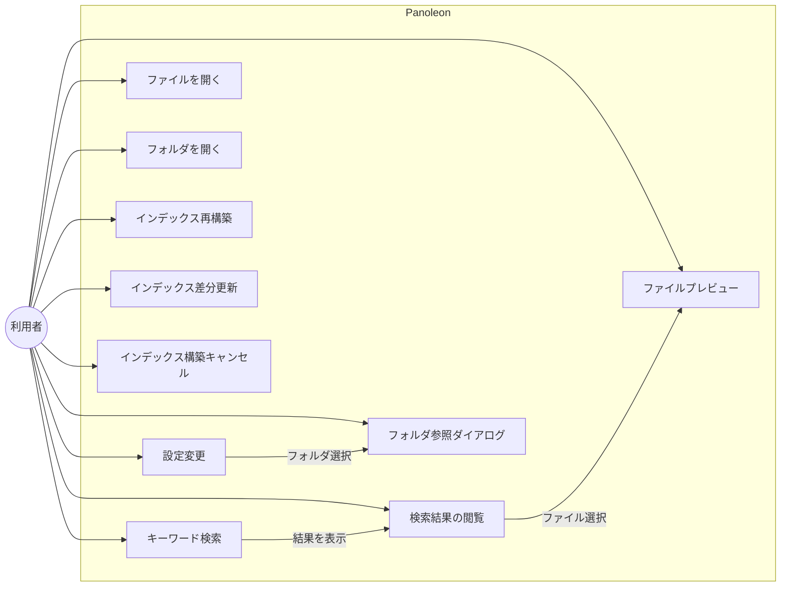

---

## 2. パッケージ図（レイヤー構成）

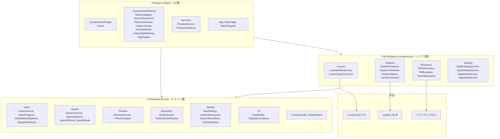

---

## 3. クラス図

### 3.1 Core 層

```mermaid
classDiagram
    direction TB

    class IIndexService {
        <<interface>>
        +InitializeAsync(indexPath, readOnly, ct)
        +LastInitializeFailed : bool
        +RebuildIndexAsync(folders, progress, options, ct)
        +UpdateIndexAsync(folders, progress, options, ct)
        +LastSkippedFiles : IReadOnlyList~SkippedFileEntry~
        +ListIndexedItems(targetFolders, targetExtensions) IReadOnlyList~SearchResultItem~
    }

    class ISearchService {
        <<interface>>
        +SearchAsync(query, options, progress, ct) Task~SearchResult~
        +RefreshIndex()
        +Warmup()
        +TryGetStoredContentAsync(filePath, ct)
        +TryGetContentPreviewsAsync(paths, query, mode, ct)
        +GetHighlightTerms(query, mode)
    }

    class IPreviewService {
        <<interface>>
        +GetPreviewAsync(path, searchQuery, ct) Task~PreviewResult~
    }

    class ITextExtractor {
        <<interface>>
        +SupportedExtensions
        +CanExtract(extension) bool
        +ExtractTextAsync(filePath, ct) Task~string~
    }

    class TextExtractorFactory {
        -_extractors : IEnumerable~ITextExtractor~
        +GetExtractor(extension) ITextExtractor?
        +GetAllSupportedExtensions()
    }

    class TreeBuilder {
        <<static>>
        +BuildFullFolderTree(...)
        +ExpandPathToFile(...)
        +ExpandPathToFolder(...)
    }

    class DisplayFormatters {
        <<static>>
        +FormatDate(d) string
        +FormatLastIndexUpdate(lastUpdate) string
        +GetFileIconClass(name) string
    }

    class PreviewHelper {
        <<static>>
        +NormalizeExtension(extOrPath)
        +GetFileIconClass(name)
    }

    class ContentLimits {
        <<static>>
        +IndexMaxFileBytesForExtract : long = 1MB
        +MaxTextFileBytesToRead : long = 1MB
        +LuceneMaxTermUtf8Bytes : int = 32765
    }

    class IndexProgress {
        +ProcessedFiles : int
        +TotalFiles : int
        +CurrentFile : string?
        +ErrorCount : int
        +NoChanges : bool
    }

    class IndexRebuildOptions {
        +TargetExtensions : IReadOnlyList~string~?
    }

    class SearchOptions {
        +MaxResults : int
        +SearchMode : SearchMode
    }

    class SearchMode {
        <<enum>>
        Keyword
        Any
        Phrase
    }

    class SearchResult {
        +Items : List~SearchResultItem~
    }

    class AppSettings {
        +TargetFolders : List~string~
        +TargetExtensions : List~string~
        +IndexPath : string
        +LastIndexUpdate : DateTime?
        +AutoRebuildDailyHours : List~int~
        +ThemeMode : string
    }

    class IndexedDocument {
        +FilePath : string
        +FileName : string
        +FolderPath : string
        +Content : string
        +FileSize : long
        +LastModified : DateTime
        +FileType : string
        +IndexedAt : DateTime
    }

    class SearchResultItem {
        +FilePath : string
        +FileName : string
        +FolderPath : string
        +FileSize : long
        +LastModified : DateTime
    }

    class PreviewResult {
        +Content : string
        +LineStartOffsets : int[]
        +MatchLineNumbers : IReadOnlyList~int~
        +IsError : bool
        +SearchTerms : string[]
    }

    TextExtractorFactory --> ITextExtractor : 複数保持
    IIndexService ..> IndexProgress
    IIndexService ..> IndexRebuildOptions
    IIndexService ..> SearchResultItem
    ISearchService ..> SearchOptions
    ISearchService ..> SearchResult
    ISearchService ..> SearchMode
    SearchResult --> SearchResultItem
    SearchOptions --> SearchMode
    IPreviewService ..> PreviewResult
    DisplayFormatters ..> PreviewHelper
```

### 3.2 Infrastructure 層

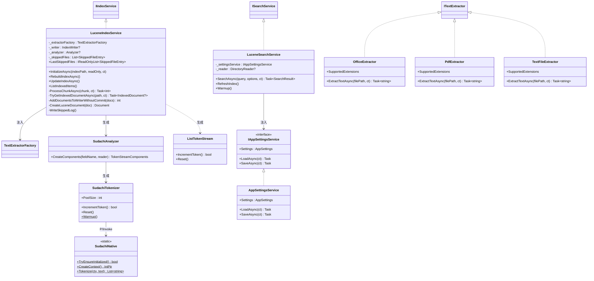

### 3.3 Blazor UI 層（コンポーネント構成）

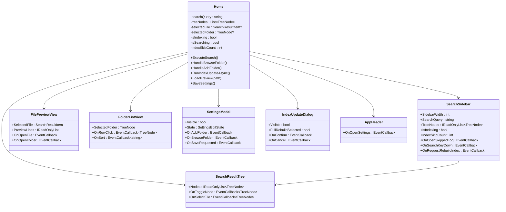

---

## 4. シーケンス図

### 4.1 検索実行

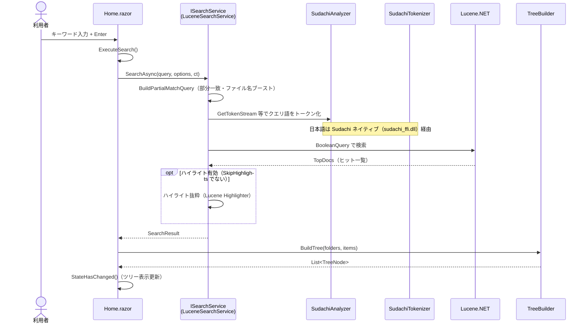

### 4.2 インデックス再構築

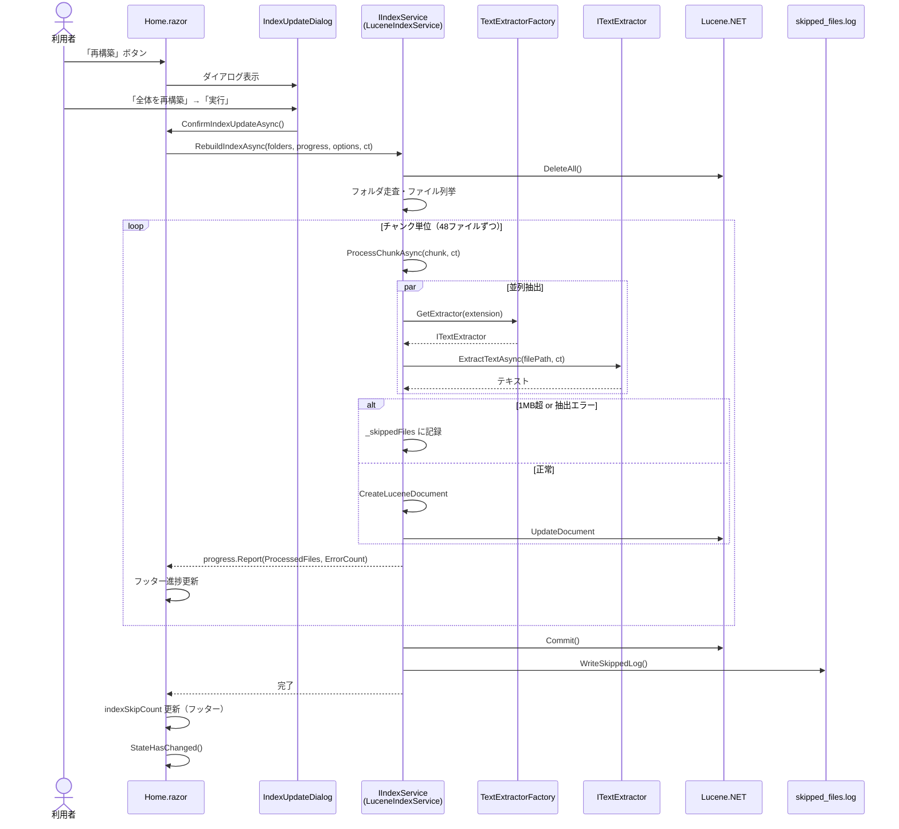

### 4.3 インデックス差分更新

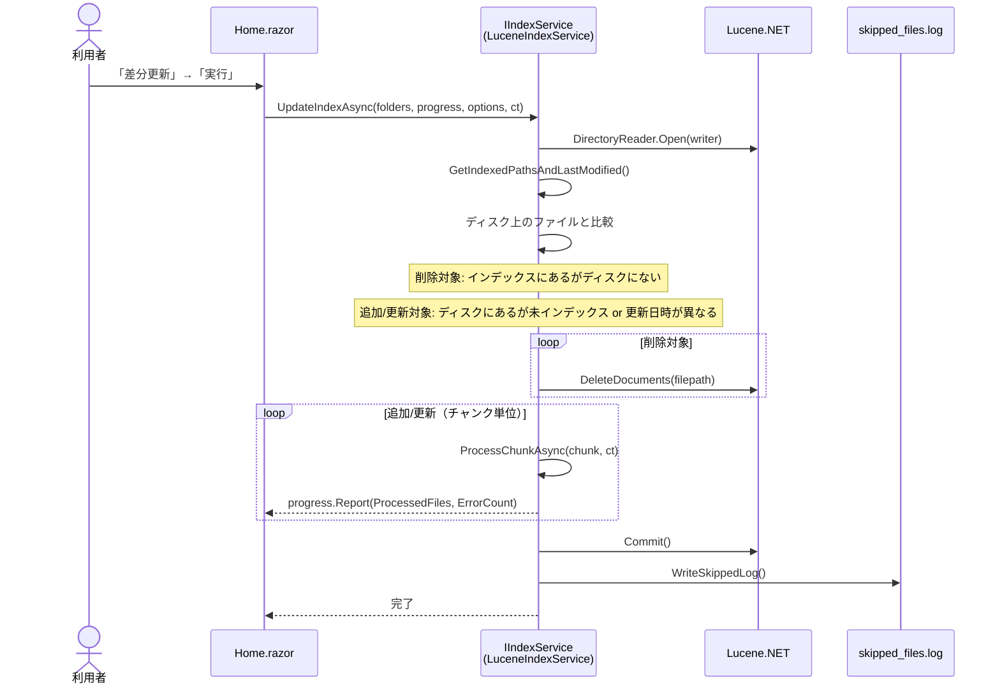

### 4.4 ファイルプレビュー

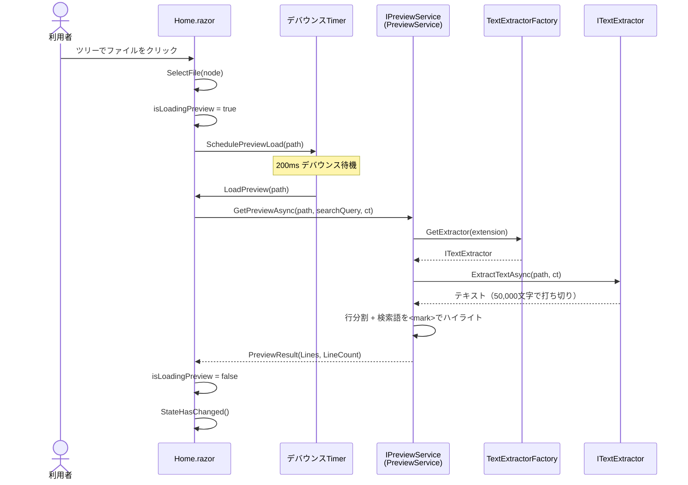

### 4.5 設定保存

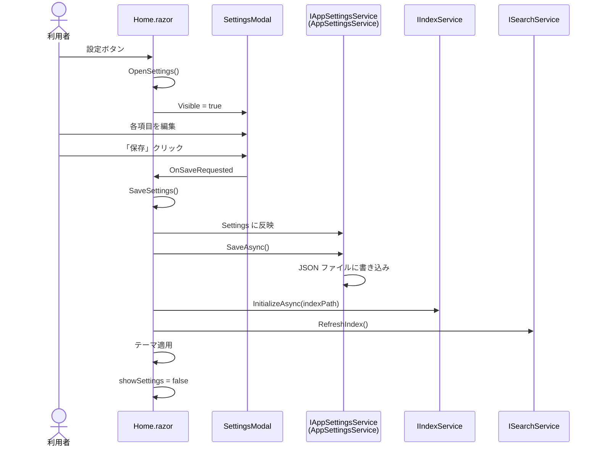

### 4.6 フォルダ参照ダイアログ

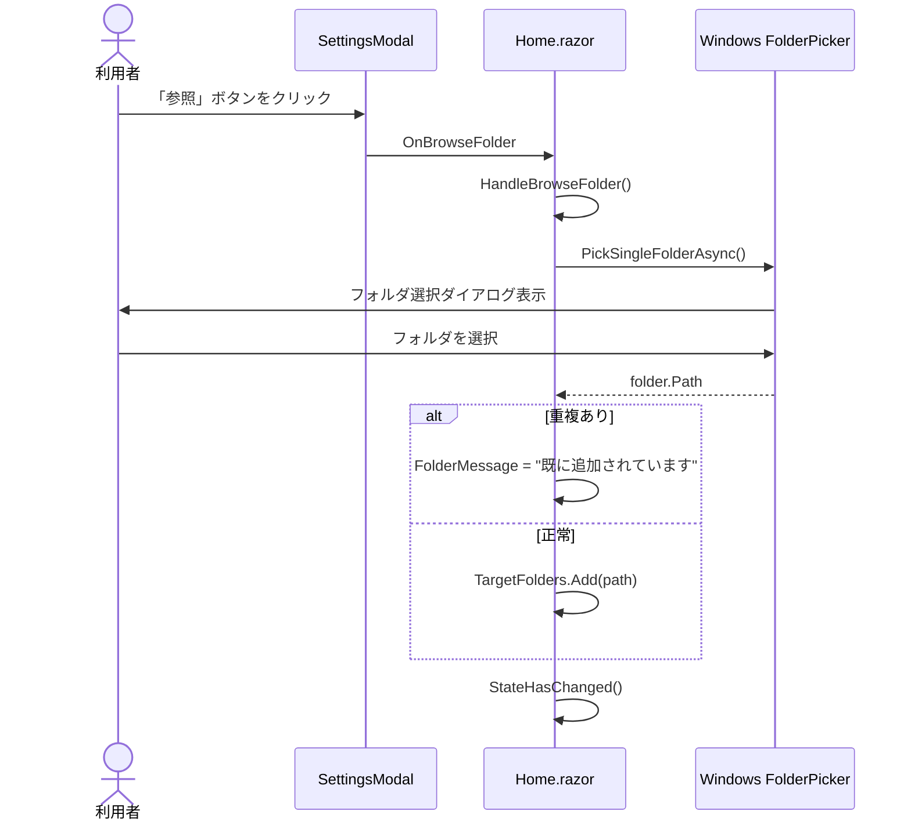

### 4.7 形態素解析（Sudachi ネイティブ）

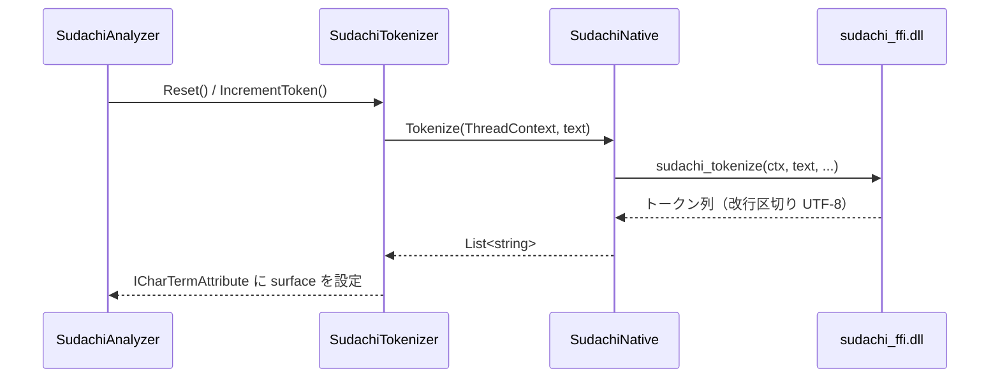

---

## 5. 状態遷移図

### 5.1 インデックス構築の状態

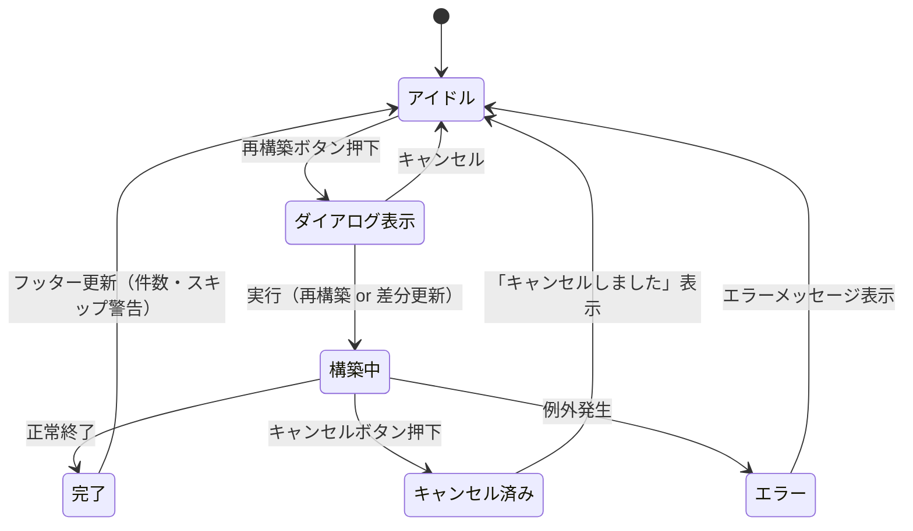

### 5.2 プレビューの状態

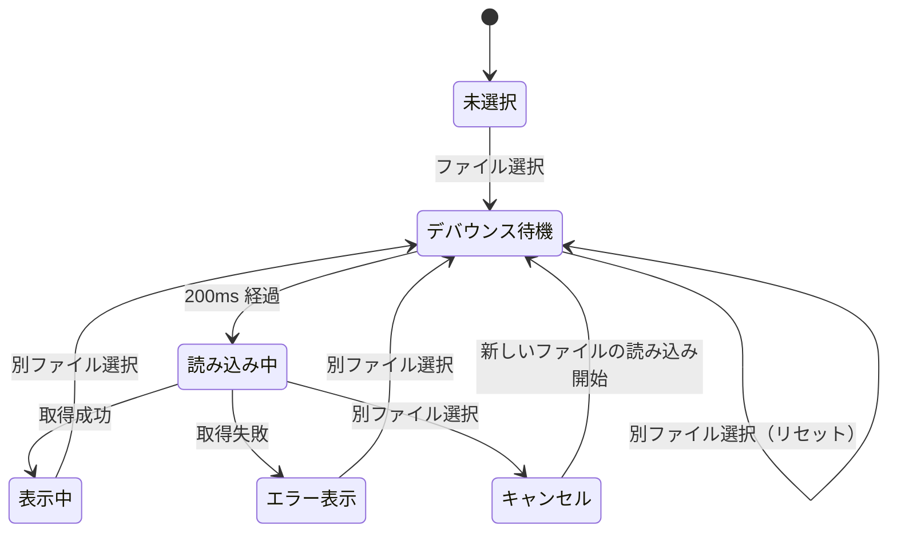

---

## 6. DI コンテナ構成図

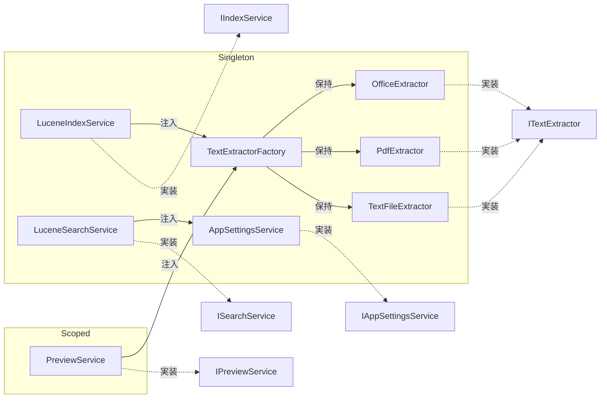

---

## 7. 参照

- [要件定義書](要件定義.md)
- [外部設計書](外部設計.md)
- [詳細設計書](詳細設計.md)
- [静的定義一覧](静的定義一覧.md)
