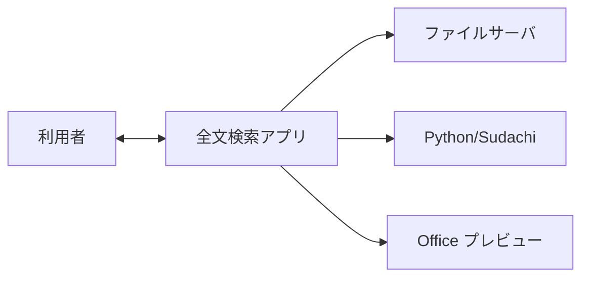
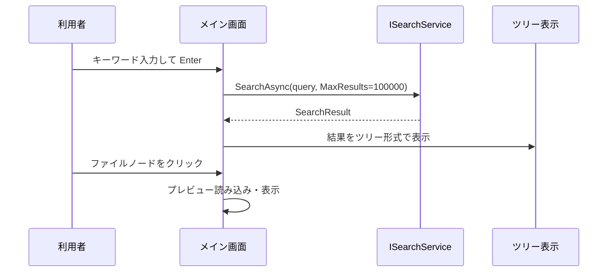

# 外部設計書

## 1. はじめに

本ドキュメントは、社内ファイルサーバ向け全文検索システムの外部仕様（利用者から見た機能・画面・操作・データの入出力）を定義する。内部実装の詳細は「詳細設計書」を参照すること。

---

## 2. システムコンテキスト

### 2.1 構成図

- **利用者**: 社内の PC に本アプリをインストールし、検索・プレビュー・設定を行う
- **ファイルサーバ**: 検索対象フォルダ（UNC パス含む）が格納されている。アプリはフォルダ一覧・ファイル読み取りを行う
- **Python / Sudachi**: 形態素解析のために外部プロセスとして SudachiPy を呼び出す
- **Office プレビュー**: Windows のプレビューハンドラ経由で Word / Excel / PowerPoint を表示する

### 2.2 画面一覧

| 画面ID | 画面名 | 説明 |
|--------|--------|------|
| SCR-1 | メイン画面 | 検索・検索結果一覧・プレビューを表示するメイン画面 |
| SCR-2 | 設定モーダル | 検索対象フォルダ・拡張子・インデックスパス・テーマ等を設定するモーダル |
| SCR-3 | インデックス更新ダイアログ | 再構築／差分更新の選択と進捗表示を行うダイアログ |

### 2.3 画面遷移

- メイン画面は常に表示の基点となる
- 設定はモーダルで開き、保存または閉じるでメインに戻る
- フッターの「再構築」ボタンでインデックス更新ダイアログを開き、差分更新 or 全体を再構築を選択して実行。進捗はメイン画面フッターに表示する

---

## 3. 画面別外部仕様

### 3.1 メイン画面（SCR-1）

#### 3.1.1 レイアウト

- **ヘッダ**: アプリタイトル・設定ボタン（画面上部）。ウィンドウのタイトルバー（OS）にも「全文検索システム」を表示する
- **左サイドバー**: 幅はリサイズ可能
  - 検索入力欄（プレースホルダ: 「キーワードで検索（Enter）」）
  - 検索結果件数バッジ
  - 検索結果ツリー（フォルダ・ファイルの階層表示）、または「検索中...」「キーワードを入力...」等の状態表示
  - フッター: インデックス最終更新日時、「再構築」ボタン（クリックでインデックス更新ダイアログを表示し、差分更新 or 全体を再構築を選択して実行）、進捗表示（更新中時）
- **右メイン領域**:
  - **フォルダ選択時**: そのフォルダ内のファイル一覧（表形式）。ソート・フィルター可能
  - **ファイル選択時**: プレビュー表示（すべてテキスト抽出の行表示。Office/PDF も抽出テキストで表示。表形式・ネイティブプレビューは行わない）＋ナビゲーション・「ファイルを開く」「フォルダを開く」等。選択変更時は 300ms デバウンスで読み込みを発行し、連続クリック時の無駄な抽出を抑える
  - **未選択時**: 「ファイルを選択」の空状態メッセージ

#### 3.1.2 入力

| 項目 | 内容 |
|------|------|
| 検索クエリ | テキスト入力。Enter で検索実行。入力変更時の自動検索・デバウンスは行わない |
| キー操作 | Enter（検索実行）、Ctrl+Enter、Ctrl+C、Ctrl+F、Esc（仕様は後述） |
| マウス | ツリーのノード展開/折りたたみ、ファイル選択、ヘッダの設定ボタン、フッターの再構築ボタン、リサイズハンドル |

#### 3.1.3 出力（表示内容）

| 領域 | 内容 |
|------|------|
| 検索結果一覧 | フォルダ別にグルーピングされたツリー。各ファイルのアイコン・ファイル名・パス等。選択行はハイライト |
| フォルダビュー | 選択フォルダ内のファイル一覧。ファイル名・更新日・種類・サイズ等。ソート列・昇降順・種類フィルター |
| プレビュー | 選択ファイルの内容。すべてテキスト抽出した行リストで表示（Office/PDF も同様）。検索語ハイライト・コードの場合はシンタックスハイライト。表形式・ネイティブプレビューは使用しない |
| ステータス | 検索結果件数、インデックス再構築中の進捗（処理数/総数、現在ファイル、エラー数）、検索エラーメッセージ |

#### 3.1.4 状態・メッセージ

- 検索対象フォルダが未設定の場合、インデックス再構築時にメッセージを表示する
- 検索中は「検索中...」を表示
- 検索結果 0 件時はキーワードの有無に応じたメッセージを表示
- 再構築中は検索入力欄を無効化し「再構築中は検索できません」を表示

---

### 3.2 設定モーダル（SCR-2）

#### 3.2.1 レイアウト

- モーダル（閉じるボタン（×）または「キャンセル」で閉じる。背面クリックでは閉じない）
- セクション: 表示（テーマ）、検索対象フォルダ、対象拡張子、シンタックスハイライト用（拡張子→言語）、インデックス保存先、インデックス（最終更新、定期再構築間隔、「フォルダを開く」）

#### 3.2.2 入力

| 項目 | 内容 |
|------|------|
| テーマ | Dark / Light / System のいずれか |
| 検索対象フォルダ | フォルダパスを追加・削除。追加はテキスト入力＋「追加」ボタン |
| 対象拡張子 | 拡張子（例: .txt）を追加・削除。空の場合は抽出器の全対応拡張子を使用する旨を説明 |
| 拡張子→言語（シンタックスハイライト用） | 拡張子と言語名（例: .cs → csharp）を追加・削除。空の場合は組み込みマップのみ使用 |
| インデックス保存先 | ローカルフォルダパス。変更後は再構築が必要な旨を表示 |
| 自動再構築間隔 | 分単位。0 で無効 |

#### 3.2.3 出力・動作

- 「保存」で設定を永続化し、モーダルを閉じる。閉じるボタン（×）または「キャンセル」で閉じた場合は未保存の変更は破棄される
- フォルダ追加時: 空・重複・存在しない等で警告メッセージを表示可能
- 「フォルダを開く」ボタンでインデックス保存先フォルダをエクスプローラーで開く

---

### 3.3 インデックス更新ダイアログ（SCR-3）

#### 3.3.1 入力

- 2 つの選択ボタン（「差分更新」「全体を再構築」）のいずれかを選択
- 「実行」「キャンセル」ボタン

#### 3.3.2 出力

- 進捗: 処理済みファイル数 / 総ファイル数、現在処理中のファイル名、エラー数
- 完了後はダイアログを閉じ、メイン画面のインデックス最終更新が更新される

---

## 4. 操作一覧（ユーザー操作とシステムの応答）

### 4.1 検索実行の流れ（シーケンス）

### 4.2 操作一覧表

| 操作 | トリガー | システムの応答 |
|------|----------|----------------|
| 検索実行 | 検索クエリ入力＋Enter | 全文検索を実行し、結果をツリー形式で表示。選択行があればプレビューを更新 |
| ファイルを開く | Enter | 選択中のファイルを関連アプリで開く |
| フォルダを開く | Ctrl+Enter | 選択中のファイルの親フォルダをエクスプローラーで開く |
| パスをコピー | Ctrl+C | 選択中のファイルのフルパスをクリップボードにコピー |
| 検索にフォーカス | Ctrl+F | 検索入力欄にフォーカス |
| 検索クリア | Esc | 検索クエリと検索エラーメッセージをクリア。結果一覧はそのまま表示 |
| 設定を開く | ヘッダの設定ボタン | 設定モーダルを表示 |
| インデックス更新 | フッターの「再構築」ボタン | インデックス更新ダイアログを表示。ダイアログで「差分更新」または「全体を再構築」を選択して「実行」で更新。実行中はフッターに「キャンセル」ボタンを表示し、押下で構築を中止できる |
| ノード展開/折りたたみ | ツリーのフォルダノードをクリック | 子の表示/非表示を切り替え。右側にフォルダ内一覧を表示 |
| ファイル選択 | ツリーのファイルノードをクリック | 該当ファイルを選択し、プレビューを表示 |

---

## 5. データの入出力（外部から見たデータ）

### 5.1 設定データ

- **保存先**: ユーザーの LocalApplicationData 配下（例: `%LocalApplicationData%\FullTextSearch\settings.json`）
- **主な項目**:
  - 検索対象フォルダ（文字列のリスト）
  - 対象拡張子（文字列のリスト。空可）
  - 拡張子→言語マップ（シンタックスハイライト用。キー=拡張子、値=言語名。空可）
  - インデックス保存先（文字列）
  - プレビュー遅延（ミリ秒。AppSettings に存在するが、設定画面では編集不可）
  - 自動再構築間隔（分。0 で無効）
  - テーマ（Dark / Light / System）
  - インデックス最終更新日時（日時。表示用）

### 5.2 検索の入出力

- **入力**:
  - 検索クエリ（文字列）
  - オプション: 最大件数、ファイル種類フィルター、日付範囲、フォルダフィルター等（UI から利用可能な範囲で提供）
- **出力**:
  - 検索結果のリスト。各要素: ファイルパス、ファイル名、フォルダパス、サイズ、最終更新日時、ファイル種類、スコア、マッチ箇所の抜粋（テキスト＋ハイライト開始/終了位置）
  - 総ヒット件数、検索時間（ミリ秒）
  - 表示上はフォルダごとにグルーピングしたツリーとして表示

### 5.3 プレビューの入出力

- **入力**:
  - ファイルパス（文字列）
  - 検索クエリ（ハイライト用。省略可）
- **出力**:
  - 常にテキスト（行リスト）形式。行のリスト（各行は表示用テキスト＋ハイライト有無）と行数。Office/PDF もテキスト抽出した行で表示し、表形式・HTML プレビューは行わない。
  - ファイル選択変更時は 300ms デバウンス後にプレビュー取得を実行する。

### 5.4 インデックス

- **保存先**: 設定で指定したフォルダ（デフォルトは LocalApplicationData/FullTextSearch/Index）
- **外部から見た振る舞い**: 指定フォルダ内のファイルを走査し、テキストを抽出してインデックスに登録。再構築は全削除のうえ全件追加。差分更新は追加・更新・削除のみ反映。

---

## 6. 参照

- [要件定義書](要件定義.md)
- [詳細設計書](詳細設計.md)
- [README.md](../README.md)
