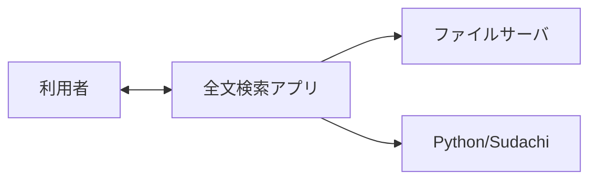
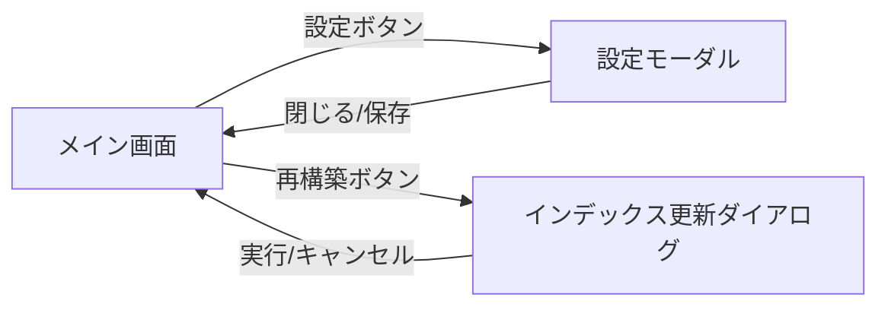
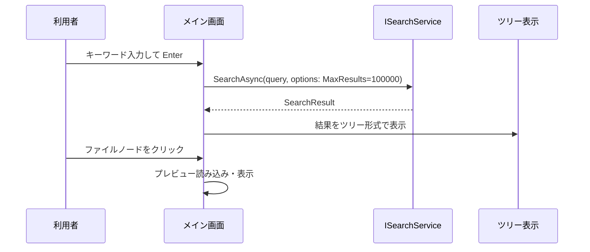

# 外部設計書

## 1. はじめに

本ドキュメントは、社内ファイルサーバ向け全文検索システムの外部仕様（利用者から見た機能・画面・操作・データの入出力）を定義する。内部実装の詳細は「詳細設計書」を参照すること。

**文言の所在**: 画面上のユーザー向け文言は **`FileSearch.Messages.UserMessages`**（プロジェクト `FileSearch.Messages`）に集約し、インデックス処理・スキップログ・ファイル種別表示名は **`FullTextSearch.Core.IndexMessages`** を用いる。一覧・ID は [メッセージ一覧.md](メッセージ一覧.md) を参照。

---

## 2. システムコンテキスト

### 2.1 構成図

```mermaid
flowchart LR
  User[利用者]
  App[全文検索アプリ]
  FileServer[ファイルサーバ]
  Python[Python/Sudachi]
  User <--> App
  App --> FileServer
  App --> Python
```

- **利用者**: 社内の PC に本アプリをインストールし、検索・プレビュー・設定を行う
- **ファイルサーバ**: 検索対象フォルダ（UNC パス含む）が格納されている。アプリはフォルダ一覧・**ファイル読み取り**（テキスト・Office・PDF 等）を行う。プレビュー・インデックスはいずれも **テキスト抽出** による行表示であり、Windows のプレビューパネルやネイティブ Office 埋め込み表示は用いない
- **Python / Sudachi**: 形態素解析のために外部プロセスとして SudachiPy を呼び出す

### 2.2 画面一覧

| 画面ID | 画面名 | 説明 |
|--------|--------|------|
| SCR-1 | メイン画面 | 検索・検索結果一覧・プレビューを表示するメイン画面 |
| SCR-2 | 設定モーダル | 検索対象フォルダ・拡張子・インデックスパス・テーマ等を設定するモーダル |
| SCR-3 | インデックス更新ダイアログ | 再構築／差分更新の選択と進捗表示を行うダイアログ |

画面設計書トレーサビリティ用の項目 ID は以下のとおり。
- SCR-1（メイン画面）: `M-01` 〜 `M-17`
- SCR-2（設定モーダル）: `S-01` 〜 `S-17`
- SCR-3（インデックス更新ダイアログ）: `I-01` 〜 `I-09`

### 2.3 画面遷移

```mermaid
flowchart LR
  Main[メイン画面]
  Settings[設定モーダル]
  IndexDlg[インデックス更新ダイアログ]
  Main -->|設定ボタン| Settings
  Settings -->|閉じる/保存| Main
  Main -->|再構築ボタン| IndexDlg
  IndexDlg -->|実行/キャンセル| Main
```

- メイン画面は常に表示の基点となる
- 設定はモーダルで開き、保存または閉じるでメインに戻る
- フッターの「再構築」ボタンでインデックス更新ダイアログを開き、差分更新 or 全体を再構築を選択して実行。進捗はメイン画面フッターに表示する

---

## 3. 画面別外部仕様

### 3.1 メイン画面（SCR-1）

#### 3.1.1 レイアウト

- **ヘッダ**: アプリタイトル・設定ボタン（画面上部）。ウィンドウのタイトルバー（OS）にも「全文検索システム」を表示する
- **左サイドバー**: 幅はリサイズ可能
  - 検索入力欄（プレースホルダ: 「キーワードで検索（Enter）」）
  - 検索結果件数バッジ
  - 検索結果ツリー（フォルダ・ファイルの階層表示）、または「検索中...」「検索キーワードを入力」「Enter で検索」「結果なし」等の状態表示
  - フッター: インデックス最終更新日時、「再構築」ボタン（クリックでインデックス更新ダイアログを表示し、差分更新 or 全体を再構築を選択して実行）、進捗表示（更新中時）
- **右メイン領域**:
  - **フォルダ選択時**: そのフォルダ内のファイル一覧（表形式）。ソート・フィルター可能
  - **ファイル選択時**: プレビュー表示（すべてテキスト抽出の行表示。Office/PDF も抽出テキストで表示。表形式・ネイティブプレビューは行わない）＋ナビゲーション・「開く」「フォルダ」ボタン等。選択変更時は **200ms** デバウンス（`Home.razor.cs` の定数 `PreviewDebounceMs` を `Home.Preview.cs` の `SchedulePreviewLoad` が使用）後に読み込みを発行し、連続クリック時の無駄な抽出を抑える
  - **未選択時**: 「ファイルを選択」の空状態メッセージ

#### 3.1.2 入力

| 項目 | 内容 |
|------|------|
| 検索クエリ | テキスト入力。Enter で検索実行。入力変更時の自動検索は行わない |
| キー操作 | 検索欄にフォーカスがあるとき: **Enter**（検索実行）、**Esc**（検索クエリと検索エラー表示をクリア）。**Ctrl+Enter / Ctrl+C / Ctrl+F** による独自ショートカットは **未実装**（ファイルを開く・フォルダを開くはプレビュー上のボタン） |
| マウス | ツリーのノード展開/折りたたみ、ファイル選択、ヘッダの設定ボタン、フッターの再構築ボタン、リサイズハンドル |

#### 3.1.3 出力（表示内容）

| 領域 | 内容 |
|------|------|
| 検索結果一覧 | フォルダ別にグルーピングされたツリー。各ファイルのアイコン・ファイル名・パス等。選択行はハイライト |
| フォルダビュー | 選択フォルダ内のファイル一覧。ファイル名・更新日・種類・サイズ等。ソート列・昇降順・種類フィルター |
| プレビュー | 選択ファイルの内容。すべてテキスト抽出した行リストで表示（Office/PDF も同様）。検索語に一致する行・箇所の **ハイライト**（`<mark>`）のみ。シンタックスハイライト（言語別色分け）は **行わない**。表形式・ネイティブプレビューは使用しない |
| ステータス | 検索結果件数、インデックス再構築中の進捗（処理数/総数、現在ファイル、スキップ数）、スキップ警告（件数）、検索エラーメッセージ |

#### 3.1.4 状態・メッセージ

- 表示文言の定義は [メッセージ一覧.md](メッセージ一覧.md) と `UserMessages` / `IndexMessages` に従う
- 検索対象フォルダが未設定の場合、インデックス再構築時にメッセージを表示する
- 検索中は「検索中...」を表示
- 検索結果 0 件時はキーワードの有無に応じたメッセージを表示
- 再構築中は検索入力欄を無効化し「再構築中は検索できません」を表示
- インデックス完了後、スキップされたファイルがある場合はフッターに「N 件がスキップされました」を警告色で表示し、その行をクリックすると `skipped_files.log` を既定アプリで開いて詳細を参照できる

---

### 3.2 設定モーダル（SCR-2）

#### 3.2.1 レイアウト

- モーダル（閉じるボタン（×）または「キャンセル」で閉じる。背面クリックでは閉じない）
- セクション: 表示（テーマ）、検索対象フォルダ、対象拡張子、インデックス保存先、インデックス（最終更新、定期再構築間隔、「フォルダを開く」）

#### 3.2.2 入力

| 項目 | 内容 |
|------|------|
| テーマ | ダークモード / ライトモード / システムに従う のいずれか |
| 検索対象フォルダ | フォルダパスを追加・削除。追加はテキスト入力＋「追加」ボタン、または「参照」ボタンで OS のフォルダ選択ダイアログから選択 |
| 対象拡張子 | 拡張子（例: .txt）を追加・削除。空の場合は抽出器の全対応拡張子を使用する旨を説明 |
| インデックス保存先 | ローカルフォルダパス。変更後は再構築が必要な旨を表示 |
| 自動再構築間隔 | 分単位。0 で無効 |

#### 3.2.3 出力・動作

- 「保存」で設定を永続化し、モーダルを閉じる。閉じるボタン（×）または「キャンセル」で閉じた場合は未保存の変更は破棄される
- 保存時の主な入力チェック（警告メッセージ ID は [メッセージ一覧.md](メッセージ一覧.md) を参照）:
  - 検索対象フォルダ: 空入力は不可（W-02）、存在しないパスは不可（W-03）、重複追加は不可（W-04）
  - 対象拡張子: 先頭 `.` を含む拡張子形式のみ受け付け、重複追加は不可（W-04）
  - インデックス保存先: 空入力は不可（W-07）、存在しないパスは不可（W-08）。いずれの場合も保存しない（フォルダの自動作成は行わない）
- 「フォルダを開く」ボタンでインデックス保存先フォルダをエクスプローラーで開く

---

### 3.3 インデックス更新ダイアログ（SCR-3）

#### 3.3.1 入力

- 2 つの選択ボタン（「差分更新」「全体を再構築」）のいずれかを選択
- 「実行」「キャンセル」ボタン

#### 3.3.2 出力

- 進捗: 処理済みファイル数 / 総ファイル数、現在処理中のファイル名、スキップ数（抽出エラー・サイズ超過等）
- 完了後はダイアログを閉じ、メイン画面のインデックス最終更新が更新される
- スキップされたファイルがある場合、フッターに警告メッセージ（件数のみ。ログファイルのパスは画面上に出さない）を表示し、クリックでスキップログを開ける

---

## 4. 操作一覧（ユーザー操作とシステムの応答）

### 4.1 検索実行の流れ（シーケンス）

```mermaid
sequenceDiagram
  participant User as 利用者
  participant UI as メイン画面
  participant Search as ISearchService
  participant Tree as ツリー表示
  User->>UI: キーワード入力して Enter
  UI->>Search: SearchAsync(query, options: MaxResults=100000)
  Search-->>UI: SearchResult
  UI->>Tree: 結果をツリー形式で表示
  User->>UI: ファイルノードをクリック
  UI->>UI: プレビュー読み込み・表示
```

### 4.2 操作一覧表

| 操作 | トリガー | システムの応答 |
|------|----------|----------------|
| 検索実行 | 検索クエリ入力＋Enter | 全文検索を実行し、結果をツリー形式で表示 |
| ファイルを開く | プレビュー領域の「開く」ボタン | 選択中のファイルを関連アプリで開く |
| フォルダを開く | プレビュー領域の「フォルダ」ボタン | 選択中のファイルの場所をエクスプローラーで開く（`/select` 相当） |
| パスをコピー | （未実装） | 現行版ではクリップボード操作なし |
| 検索にフォーカス | （未実装のグローバルショートカット） | 初回表示時はルーティングで検索入力へフォーカス移動（`FocusOnNavigate`） |
| 検索クリア | 検索欄で Esc | 検索クエリと検索エラーメッセージをクリア。結果ツリーはそのまま残る場合がある |
| 設定を開く | ヘッダの設定ボタン | 設定モーダルを表示 |
| インデックス更新 | フッターの「再構築」ボタン | インデックス更新ダイアログを表示。ダイアログで「差分更新」または「全体を再構築」を選択して「実行」で更新。実行中はフッターに「キャンセル」ボタンを表示し、押下で構築を中止できる |
| ノード展開/折りたたみ | ツリーのフォルダノードをクリック | 子の表示/非表示を切り替え。右側にフォルダ内一覧を表示 |
| ファイル選択 | ツリーのファイルノードをクリック | 該当ファイルを選択し、デバウンス後にプレビューを読み込む |

---

## 5. データの入出力（外部から見たデータ）

### 5.1 設定データ

- **保存先**: ユーザーの LocalApplicationData 配下（例: `%LocalApplicationData%\FullTextSearch\settings.json`）
- **主な項目**（`AppSettings` に対応）:
  - 検索対象フォルダ（文字列のリスト）
  - 対象拡張子（文字列のリスト。空可）
  - インデックス保存先（文字列）
  - 自動再構築間隔（分。0 で無効）
  - テーマ（Dark / Light / System）
  - インデックス最終更新日時（日時。表示用）

プレビュー切り替えのデバウンス時間は **コード定数（200ms）** であり、設定ファイルには保存しない。

### 5.2 検索の入出力

- **入力**:
  - 検索クエリ（文字列）
  - オプション: 最大件数、ファイル種類フィルター、日付範囲、フォルダフィルター等（UI から利用可能な範囲で提供）
- **出力**:
  - 検索結果のリスト。各要素: ファイルパス、ファイル名、フォルダパス、サイズ、最終更新日時、ファイル種類、スコア、マッチ箇所の抜粋（テキスト＋ハイライト開始/終了位置）
  - 総ヒット件数、検索時間（ミリ秒）
  - 表示上はフォルダごとにグルーピングしたツリーとして表示

### 5.3 プレビューの入出力

- **入力**:
  - ファイルパス（文字列）
  - 検索クエリ（ハイライト用。省略可）
- **出力**:
  - 常にテキスト（行リスト）形式。行のリスト（各行は表示用テキスト＋ハイライト有無）と行数。Office/PDF もテキスト抽出した行で表示し、表形式・HTML プレビューは行わない。
  - ファイル選択変更時は **200ms** デバウンス後にプレビュー取得を実行する。

### 5.4 インデックス

- **保存先**: 設定で指定したフォルダ（デフォルトは LocalApplicationData/FullTextSearch/Index）
- **外部から見た振る舞い**: 指定フォルダ内のファイルを走査し、テキストを抽出してインデックスに登録。再構築は全削除のうえ全件追加。差分更新は追加・更新・削除のみ反映。
- **コンテンツ上限**: 50MB を超えるファイルは **本文抽出を行わずインデックスにも登録しない**（検索結果にも出ない）。スキップログに記録される。抽出テキストは 500,000 文字で打ち切り（それ以下のファイルについて）。
- **スキップログ**: 抽出エラー・サイズ超過等でスキップされたファイルは、インデックス保存先フォルダ内の `skipped_files.log` に一覧が出力される。

---

## 6. 参照

- [要件定義書](要件定義.md)
- [詳細設計書](詳細設計.md)
- [README.md](../README.md)
