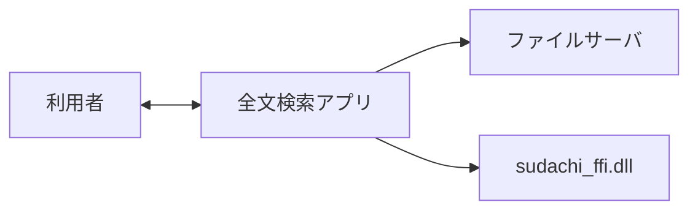
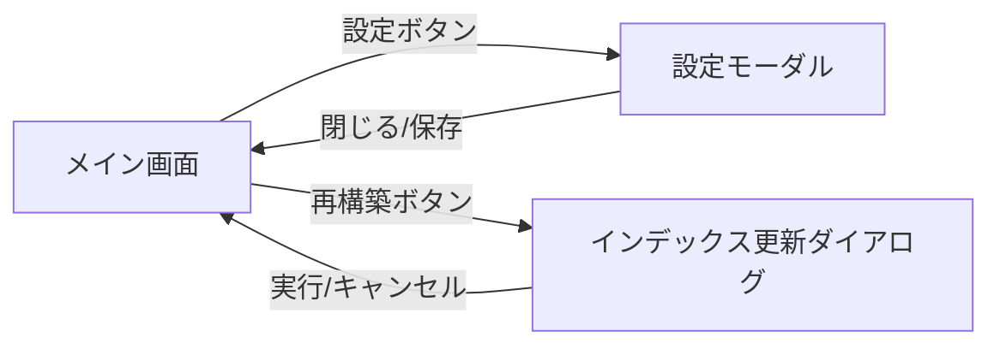
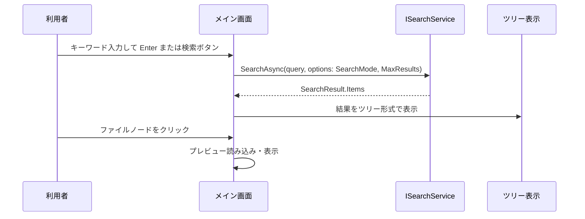

# 外部設計書

## 1. はじめに

本ドキュメントは、Panoleon（社内ファイルサーバ向け全文検索システム）の外部仕様（利用者から見た機能・画面・操作・データの入出力）を定義する。内部実装の詳細は「詳細設計書」を参照すること。

**文言の所在**: 画面上のユーザー向け文言は **`FileSearch.Messages.UserMessages`**（プロジェクト `FileSearch.Messages`）に集約し、インデックス処理・スキップログ・ファイル種別表示名は **`FullTextSearch.Core.IndexMessages`** を用いる。一覧・ID は [メッセージ一覧.md](メッセージ一覧.md) を参照。

---

## 2. システムコンテキスト

### 2.1 構成図

```mermaid
flowchart LR
  User[利用者]
  App[全文検索アプリ]
  FileServer[ファイルサーバ]
  SudachiNative[sudachi_ffi.dll]
  User <--> App
  App --> FileServer
  App --> SudachiNative
```

- **利用者**: 社内の PC に本アプリをインストールし、検索・プレビュー・設定を行う
- **ファイルサーバ**: 検索対象フォルダ（UNC パス含む）が格納されている。アプリはフォルダ一覧・**ファイル読み取り**（テキスト・Office・PDF 等）を行う。プレビュー・インデックスはいずれも **テキスト抽出** による行表示であり、Windows のプレビューパネルやネイティブ Office 埋め込み表示は用いない
- **Sudachi ネイティブ**: 形態素解析をプロセス内 DLL（`sudachi_ffi.dll`）で実行する。Python は不要

### 2.2 画面一覧

| 画面ID | 画面名 | 説明 |
|--------|--------|------|
| SCR-1 | メイン画面 | 検索・検索結果一覧・プレビューを表示するメイン画面 |
| SCR-2 | 設定モーダル | 検索対象フォルダ・拡張子・インデックスパス・テーマ等を設定するモーダル |
| SCR-3 | インデックス更新ダイアログ | 再構築／差分更新の**選択**を行うダイアログ（進捗はメイン画面フッター） |

画面設計書トレーサビリティ用の項目 ID は以下のとおり。
- SCR-1（メイン画面）: `M-01` 〜 `M-17`
- SCR-2（設定モーダル）: `S-01` 〜 `S-17`
- SCR-3（インデックス更新ダイアログ）: `I-01` 〜 `I-09`

### 2.3 画面遷移

```mermaid
flowchart LR
  Main[メイン画面]
  Settings[設定モーダル]
  IndexDlg[インデックス更新ダイアログ]
  Main -->|設定ボタン| Settings
  Settings -->|閉じる/保存| Main
  Main -->|再構築ボタン| IndexDlg
  IndexDlg -->|実行/キャンセル| Main
```

- メイン画面は常に表示の基点となる
- 設定はモーダルで開き、保存または閉じるでメインに戻る
- フッターの「再構築」ボタンでインデックス更新ダイアログを開き、差分更新 or 全体を再構築を選択して実行。進捗はメイン画面フッターに表示する

---

## 3. 画面別外部仕様

### 3.1 メイン画面（SCR-1）

#### 3.1.1 レイアウト

- **起動**: テーマ連動のブートスプラッシュ（ロゴ・進捗バー・段階メッセージ）。最低 **約 2.6 秒**（`boot-splash.js`）表示後、メイン画面へ。版表示は `ApplicationDisplayVersion` → `AppVersion.Label`（WebView 注入）
- **サイドバー上部**: **「全文検索システム」** 見出し（`UserMessages.SidebarTitle`）と設定ボタン（歯車）。ウィンドウタイトルは **`Panoleon v{版}`**（`AppWindowTitle.Current` = `AppVersion.Display`）
- **左サイドバー**: 幅はリサイズ可能
  - 検索モード（AND検索 / OR検索 / 完全一致検索）のラジオボタン
  - 検索入力欄（プレースホルダ: 「キーワードを入力…」）と **検索** ボタン（Enter でも検索可）
  - 起動時から **フォルダツリー**（検索前閲覧）または検索結果ツリー。検索中はツリー領域に **CuteLoader**（スピナーのみ）。件数バッジ・`（n/N 件）` 進捗は**表示しない**
  - 「検索中...」「検索キーワードを入力」「検索ボタンまたは Enter で検索」「結果なし」等の状態表示
  - フッター: インデックス最終更新日時、「再構築」ボタン（非管理者は非活性）、構築中は **％ + ETA（推定可能時）**・処理数/総数・プログレスバー・キャンセル
- **右メイン領域**:
  - **フォルダ選択時**: そのフォルダ内のファイル一覧（表形式）。列は **名前 / 内容 / 更新日時**。列幅はエクスプローラー式にドラッグでリサイズ可能。ソート・種類フィルター可能
  - **ファイル選択時**: プレビュー表示（すべてテキスト抽出の行表示。Office/PDF も抽出テキストで表示。表形式・ネイティブプレビューは行わない）＋ナビゲーション・「開く」「フォルダ」ボタン等。選択変更時は **200ms** デバウンス（`Home.razor.cs` の定数 `PreviewDebounceMs` を `Home.Preview.cs` の `SchedulePreviewLoad` が使用）後に読み込みを発行し、連続クリック時の無駄な抽出を抑える
  - **未選択時**: 「ファイルを選択」の空状態メッセージ

#### 3.1.2 入力

| 項目 | 内容 |
|------|------|
| 検索クエリ | テキスト入力。Enter で検索実行。入力変更時の自動検索は行わない |
| キー操作 | 検索欄にフォーカスがあるとき: **Enter**（検索実行）、**Esc**（閲覧モードへ復帰: クエリ・検索結果・選択をクリアしフォルダツリーを再表示）。空クエリで検索ボタン押下も閲覧モード復帰。**Ctrl+Enter / Ctrl+C / Ctrl+F** による独自ショートカットは **未実装**
| マウス | ツリーのノード展開/折りたたみ、ファイル選択、サイドバー上部の設定ボタン、フッターの再構築ボタン、リサイズハンドル。**Ctrl + マウスホイール** で左サイドバー／右メインを **独立に** 拡大／縮小（倍率 0.5〜3.0、10% 刻み）。WebView の既定全体ズームは抑止する |

#### 3.1.3 出力（表示内容）

| 領域 | 内容 |
|------|------|
| 検索結果一覧 | フォルダ別にグルーピングされたツリー。各ファイルのアイコン・ファイル名等。選択行はハイライト |
| フォルダビュー | 選択フォルダ内のファイル一覧。**名前 / 内容**（先頭行または検索マッチ行）**/ 更新日時**。列幅リサイズ・ソート・種類フィルター |
| プレビュー | 選択ファイルの内容。すべてテキスト抽出した行リストで表示（Office/PDF も同様）。検索語に一致する行・箇所の **ハイライト**（`<mark>`）のみ。シンタックスハイライト（言語別色分け）は **行わない**。表形式・ネイティブプレビューは使用しない |
| ステータス | 検索結果件数、インデックス再構築中の進捗（**％ + ETA**、処理数/総数、現在ファイルは tooltip）、**完了後**のスキップ警告（件数）、検索エラーメッセージ |

#### 3.1.4 状態・メッセージ

- 表示文言の定義は [メッセージ一覧.md](メッセージ一覧.md) と `UserMessages` / `IndexMessages` に従う
- 検索対象フォルダが未設定の場合、インデックス再構築時にメッセージを表示する
- 検索中は「検索中...」を表示
- 検索結果 0 件時はキーワードの有無に応じたメッセージを表示
- 再構築中は検索入力欄を無効化し「再構築中は検索できません」を表示
- インデックス完了後、スキップされたファイルがある場合はフッターに「N 件がスキップされました」を警告色で表示し、その行をクリックすると `skipped_files.log` を既定アプリで開いて詳細を参照できる

---

### 3.2 設定モーダル（SCR-2）

#### 3.2.1 レイアウト

- モーダル（閉じるボタン（×）または「キャンセル」で閉じる。背面クリックでは閉じない）
- フッター: **キャンセル**（ゴースト）・**保存**（青系プライマリ、`settings-btn-primary`）
- セクション: 表示（テーマ）、検索対象フォルダ、対象拡張子、インデックス保存先、インデックス（最終更新、自動更新の時刻）

#### 3.2.2 入力

| 項目 | 内容 |
|------|------|
| テーマ | ダークモード / ライトモード / システムに従う のいずれか |
| 検索対象フォルダ | 一覧表示と **アイコンボタンのみ**（フォルダ追加・削除）。パス手入力欄・「追加」「参照」等のテキストボタンはない。追加は OS のフォルダ選択ダイアログ（`+` アイコン） |
| 対象拡張子 | 拡張子（例: .txt）を追加・削除。空の場合は抽出器の全対応拡張子を使用する旨を説明 |
| インデックス保存先 | 1 フォルダ。パス表示とフォルダ選択アイコン（手入力欄なし）。変更後は再構築が必要な旨を表示 |
| 自動更新 | 有効化チェックと **日本標準時 0〜23 時**のグリッド（`AutoRebuildDailyHours`）。未選択で無効。差分更新を指定時刻枠で実行 |

#### 3.2.3 出力・動作

- 「保存」で設定を永続化し、モーダルを閉じる。閉じるボタン（×）または「キャンセル」で閉じた場合は未保存の変更は破棄される
- 保存時の主な入力チェック（警告メッセージ ID は [メッセージ一覧.md](メッセージ一覧.md) を参照）:
  - 検索対象フォルダ: フォルダピッカーで存在しないパスは追加されない。重複追加は不可（W-04）
  - 対象拡張子: 先頭 `.` がない場合は自動で補完して登録する。重複追加は不可（W-04）
  - インデックス保存先: 空入力は不可（W-07）、存在しないパスは不可（W-08）。いずれの場合も保存しない（フォルダの自動作成は行わない）
- 管理者が保存すると `shared.json`（`indexPath` + `targetFolders`）へ自動書き込み（`IAppModeService.TrySaveSharedConfig`）

---

### 3.3 インデックス更新ダイアログ（SCR-3）

#### 3.3.1 レイアウト

- 2 カラムの選択カード（**差分更新** / **全体を再構築**）。アイコン・タイトル・説明文
- フッター: **キャンセル**（ゴースト）・**実行**（青系プライマリ）

#### 3.3.2 入力

- 2 つの選択カード（radiogroup）のいずれかを選択
- 「実行」「キャンセル」ボタン、× ボタン
- **背面クリックでは閉じない**

#### 3.3.3 出力

- **進捗はダイアログ内に表示しない**。「実行」後はダイアログを閉じ、メイン画面フッターに進捗を表示
- 完了後はインデックス最終更新が更新される
- スキップがあればフッターに警告行（クリックで `skipped_files.log` を開く）
- 構築中フッターの「キャンセル」でロールバック（`IndexWriter.Rollback`）

---

## 4. 操作一覧（ユーザー操作とシステムの応答）

### 4.1 検索実行の流れ（シーケンス）

```mermaid
sequenceDiagram
  participant User as 利用者
  participant UI as メイン画面
  participant Search as ISearchService
  participant Tree as ツリー表示
  User->>UI: キーワード入力して Enter または検索ボタン
  UI->>Search: SearchAsync(query, options: SearchMode, MaxResults)
  Search-->>UI: SearchResult.Items
  UI->>Tree: 結果をツリー形式で表示
  User->>UI: ファイルノードをクリック
  UI->>UI: プレビュー読み込み・表示
```

### 4.2 操作一覧表

| 操作 | トリガー | システムの応答 |
|------|----------|----------------|
| 検索実行 | 検索クエリ入力＋Enter または検索ボタン | 全文検索を実行し、結果をツリー形式で表示。検索中は CuteLoader のみ |
| ファイルを開く | プレビュー領域の「開く」ボタン | 選択中のファイルを関連アプリで開く |
| フォルダを開く | プレビュー領域の「フォルダ」ボタン | 選択中のファイルの場所をエクスプローラーで開く（`/select` 相当） |
| パスをコピー | （未実装） | 現行版ではクリップボード操作なし |
| 検索にフォーカス | （未実装のグローバルショートカット） | 初回表示時はルーティングで検索入力へフォーカス移動（`FocusOnNavigate`） |
| 検索クリア / 閲覧復帰 | 検索欄で Esc、または空クエリで検索 | 閲覧モードへ復帰（ツリー再構築・選択クリア） |
| 設定を開く | サイドバー上部の設定ボタン | 設定モーダルを表示 |
| インデックス更新 | フッターの「再構築」ボタン | インデックス更新ダイアログを表示。ダイアログで「差分更新」または「全体を再構築」を選択して「実行」で更新。実行中はフッターに「キャンセル」ボタンを表示し、押下で構築を中止できる |
| ノード展開/折りたたみ | ツリーのフォルダノードをクリック | 子の表示/非表示を切り替え。右側にフォルダ内一覧を表示 |
| ファイル選択 | ツリーのファイルノードをクリック | 該当ファイルを選択し、デバウンス後にプレビューを読み込む |
| 領域別ズーム | **Ctrl + マウスホイール**（左サイドバー上 or 右メイン上） | カーソル位置の領域のみ拡大／縮小（0.5〜3.0、10% 刻み）。もう一方の領域には影響しない。**Ctrl + 0** でフォーカス側のみ等倍リセット。倍率は **永続化されず**、アプリ再起動・再描画で等倍に戻る |

---

## 5. データの入出力（外部から見たデータ）

### 5.1 設定データ

- **保存先**: ユーザーの LocalApplicationData 配下（例: `%LocalApplicationData%\FullTextSearch\settings.json`）
- **主な項目**（`AppSettings` に対応）:
  - 検索対象フォルダ（文字列のリスト）
  - 対象拡張子（文字列のリスト。空可）
  - インデックス保存先（文字列）
  - 自動更新時刻（`AutoRebuildDailyHours`。JST 0〜23 のリスト。空で無効）
  - 旧 `AutoRebuildIntervalMinutes` は読み込み時に上記へ移行
  - テーマ（Dark / Light / System）
  - インデックス最終更新日時（日時。表示用）

プレビュー切り替えのデバウンス時間は **コード定数（200ms）** であり、設定ファイルには保存しない。

### 5.2 検索の入出力

- **入力**:
  - 検索クエリ（文字列）
  - オプション（`SearchOptions`）: `MaxResults`、`SearchMode`（AND / OR / 完全一致）のみ
- **出力**:
  - `SearchResult.Items`: 各要素は `SearchResultItem`（`FilePath`, `FileName`, `FolderPath`, `FileSize`, `LastModified`）
  - 表示上はフォルダごとにグルーピングしたツリー。検索中は CuteLoader のみ（件数進捗なし）

### 5.3 プレビューの入出力

- **入力**:
  - ファイルパス（文字列）
  - 検索クエリ（ハイライト用。省略可）
- **出力**（`PreviewResult`）:
  - `Content`（正規化済み全文）、`LineStartOffsets`、`MatchLineNumbers`（1-based）、`IsError`、`SearchTerms`（ハイライト用）
  - 描画は `preview.js`（WinMerge 風）。Office/PDF もテキスト抽出。表形式・HTML プレビューは行わない
  - ファイル選択変更時は **200ms** デバウンス後にプレビュー取得を実行する

### 5.4 インデックス

- **保存先**: 設定で指定したフォルダ（デフォルトは LocalApplicationData/FullTextSearch/Index）
- **外部から見た振る舞い**: 指定フォルダ内のファイルを走査し、テキストを抽出してインデックスに登録。再構築は全削除のうえ全件追加。差分更新は追加・更新・削除のみ反映する（更新判定は最終更新日時の比較）。検索対象フォルダの設定変更で対象外になったフォルダ配下にあるインデックス済みファイルも、差分更新時に削除対象として処理される。差分更新／再構築の実行中にキャンセルされた場合は未コミットの変更を破棄し、キャンセル直前のコミット済み状態にロールバックする（中途半端な状態にはしない）。
- **設定変更の差分更新への反映**: 検索対象フォルダや対象拡張子を変更した後に差分更新を実行すると、対象から外れた（フォルダ削除・拡張子変更等）インデックス済みファイルはインデックスから削除され、新しく対象に加わったファイルは追加される。
- **キャンセル時の整合性**: インデックス更新（差分／再構築）の途中でキャンセルした場合、その回に行った未コミットの追加・削除はすべて破棄され、インデックスは開始直前のコミット済み状態を保つ。再度差分更新を実行することで続きを反映できる（全構築のやり直しは不要）。
- **自動更新（`AutoRebuildDailyHours`）**: 1 分ごとに tick し、JST で指定時刻を過ぎていて当該枠で未更新なら差分更新。非管理者は実行しない。検索操作から 30 秒以内は見送り
- **共有設定**: 管理者の保存で `shared.json` に `indexPath` / `targetFolders` / `autoRebuildDailyHours` を書き込み。**起動時**に `appmode.json` 経由で読み込み（変更追従は**再起動**）
- **コンテンツ上限**:
  - **1MB 超**（`ContentLimits.IndexMaxFileBytesForExtract`）: 本文抽出・インデックス登録・プレビュー試行を行わない（スキップログに記録）
  - **1MB 以下**: 抽出した本文を**全文**インデックス・検索（Sudachi）・プレビュー表示（文字数打ち切りなし）
- **スキップログ**: 抽出エラー・サイズ超過等でスキップされたファイルは、インデックス保存先フォルダ内の `skipped_files.log` にパスと理由が出力される。
- **構築並列化**: テキスト抽出・登録は I/O 並列（並列度 `max(2, min(8, ProcessorCount/2))`）。IndexWriter RAM 256MB、マージスレッド 1（他アプリ共存・速度安定のため）。

---

## 6. 参照

- [要件定義書](要件定義.md)
- [詳細設計書](詳細設計.md)
- [README.md](../README.md)
