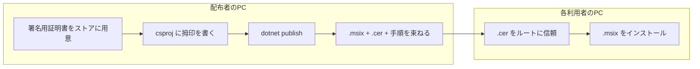

# 社内配布手順（全文検索システム）

MSIX と証明書（.cer）を社内で配布するときの**唯一の手順書**とする。ビルドコマンドの詳細は [ビルドとMSIX作成.md](ビルドとMSIX作成.md) を参照。

| 役割 | 説明 |
|------|------|
| **配布者** | .NET 8 SDK で MSIX を生成し、**.msix**・**.cer**・手順書を渡す（Python は不要） |
| **利用者** | 受け取った **.cer** と **.msix** を使い、PC にインストールする |

**開発・リリース時の文言**: 表示文字列は `FileSearch.Messages.UserMessages` と `FullTextSearch.Core.IndexMessages` に集約している。アプリ名やパッケージ表示を変える場合は [メッセージ一覧.md](メッセージ一覧.md) のチェックリスト（`index.html`・`ApplicationTitle` との同期）も確認すること。

---

## 1. 全体の流れ



- **署名**は **MSIX を生成する `dotnet publish` の処理の中**で付きます。先に「個人」証明書ストアに秘密鍵付き証明書があり、`PackageCertificateThumbprint` がそれを指している必要があります。
- **PFX** は秘密鍵の入ったファイルです。ストアにインポートしてから publish するか、`create-cert-for-msix.ps1` でストアに直接作ります。**MSIX 生成後に PFX を後から紐づける**操作ではありません。
- **CER** は公開鍵だけです。各クライアントが **信頼されたルート証明機関** に入れると、publish 時に付いた署名を信頼して .msix を入れられます。

---

## 2. ファイルとストアの対応

| もの | 内容 | 用途 |
|------|------|------|
| `Cert:\CurrentUser\My`（個人） | 秘密鍵付き証明書 | `dotnet publish` が MSIX に署名するとき **csproj の Thumbprint** で参照 |
| **.pfx** | 秘密鍵付き（パスワード保護可） | バックアップ、別 PC へ移すときにインポート |
| **.cer** | 公開鍵のみ | **利用者に配布**し、ルートにインストールしてもらう |

---

## 3. 配布者の作業

### 3.1 作業一覧

| 順 | 内容 |
|----|------|
| 1 | 署名用証明書を **個人ストア** に用意する（下記 3.2 または 3.3） |
| 2 | `src\FileSearch.Blazor\FileSearch.Blazor.csproj` の **`PackageCertificateThumbprint`** を、その証明書の Thumbprint に合わせる |
| 3 | **`dotnet publish`** で MSIX を生成する（署名はこのとき付く） |
| 4 | 配布用 **.cer** を用意する（新規作成スクリプトが出すファイル、またはエクスポート） |
| 5 | **.msix**・**.cer**・**インストール手順.txt** を同じフォルダ（または ZIP）にまとめて渡す |

### 3.2 証明書を新規に作る（推奨）

リポジトリのルートで:

```powershell
.\scripts\create-cert-for-msix.ps1
```

1. 表示された **Thumbprint** をコピーする。  
2. `FileSearch.Blazor.csproj` の `<PackageCertificateThumbprint>` をその値にする。  
3. **`installers\社内配布\全文検索システム_配布用.cer`** が出力される → 配布用の **.cer** として使う。  
4. （任意）PFX もファイルで残す場合:

```powershell
.\scripts\export-cert-pfx-cer.ps1 -Thumbprint "<Thumbprint>"
```

→ `installers\社内配布\全文検索システム.pfx` と .cer。PFX のパスワードは安全に管理する。

5. **この PC で MSIX を試しインストールする**ときは、利用者と同じく .cer をルートに追加するか、管理者 PowerShell の例:

```powershell
$cert = Get-ChildItem -Path "Cert:\CurrentUser\My\<Thumbprint>"
$store = New-Object System.Security.Cryptography.X509Certificates.X509Store("Root", "LocalMachine")
$store.Open("ReadWrite")
$store.Add($cert)
$store.Close()
```

### 3.3 既存の PFX がある／別 PC でビルドする

- **PFX** をコピーし、パスワードを指定して **個人** ストアへインポート（`Import-PfxCertificate` や PFX の右クリック）。  
- インポート後の **Thumbprint** を `PackageCertificateThumbprint` に書く（拇印が変わる場合がある）。  
- 配布用 **.cer** は certmgr で「秘密キーをエクスポートしない」形式でエクスポートしてもよい（下記 3.2 の .cer と同じ役割）。

### 3.4 MSIX の生成

**`dotnet build` では .msix は出ません。`dotnet publish` 必須です。**

```powershell
dotnet publish src\FileSearch.Blazor\FileSearch.Blazor.csproj -f net8.0-windows10.0.19041.0 -c Release
```

生成例（`Package.appxmanifest` の Version に依存）:

`src\FileSearch.Blazor\bin\Release\net8.0-windows10.0.19041.0\win10-x64\AppPackages\FileSearch.Blazor_1.0.0.0_Test\FileSearch.Blazor_1.0.0.0_x64.msix`

- バージョンを上げる: `Platforms\Windows\Package.appxmanifest` の `Identity` の `Version` を変更してから publish し直す。  
- 「証明書が見つからない」→ ストアと Thumbprint を確認。

### 3.5 配布物にまとめる

| ファイル | 説明 |
|----------|------|
| **.msix** | 3.4 で取り出したもの |
| **.cer** | 3.2 または 3.3 で用意した配布用 |
| **インストール手順.txt** | `installers\社内配布\インストール手順.txt` のコピー |

利用者には **「先に .cer、その後 .msix」** と伝える。

### 3.6 改訂配布

- ソース修正後、再度 **3.4** で publish。  
- 証明書を変えていなければ **同じ .cer** でよい。  
- バージョンは **Package.appxmanifest** で上げる。

---

## 4. 利用者の作業

### 4.1 事前に必要なもの

- Windows 10 / 11（64bit）  
- 配布された **.cer** と **.msix**  
- 未導入なら [.NET 8 デスクトップ ランタイム](https://dotnet.microsoft.com/download/dotnet/8.0)（案内に従う）  
- Python は不要  

### 4.2 .cer を信頼する（初回のみ）

**方法 A（GUI）**  
1. .cer をダブルクリック。  
2. 保存場所: **ローカル コンピューター**。  
3. ストア: **信頼されたルート証明機関**。

**方法 B（PowerShell・推奨しがち）**  
管理者 PowerShell:

```powershell
Import-Certificate -FilePath "C:\配布物のパス\全文検索システム_配布用.cer" -CertStoreLocation "Cert:\LocalMachine\Root"
```

エラー `0x800B0109` が出る場合は方法 B を試す。

### 4.3 .msix をインストールする

1. .msix をダブルクリックし、案内に従う。  
2. スタートメニューから「全文検索システム」を起動。

### 4.4 初回設定

1. **設定**で検索対象フォルダを追加し **保存**。  
2. **再構築** → **全体を再構築** を実行。  
3. キーワードで検索。

### 4.5 困ったとき

| 症状 | 対処 |
|------|------|
| 不明な発行元で入らない | **4.2** の .cer を先に完了させる |
| `0x800B0109` | **4.2 方法 B** |
| 起動しない | .NET 8 デスクトップ ランタイムを確認 |
| プレビューが出ない | Office は不要（テキスト抽出）。「開く」だけ関連アプリが要る場合あり |

---

## 5. 証明書なしの配布（参考）

社内で証明書を渡したくない場合:

- 配布者: `scripts\build-dist.bat`（または `build-dist.ps1`）→ `installers\dist\FileSearch_win-x64.zip`。実行時は `publish` の前に `check-webview-strings.ps1` が走り、`index.html` と `UserMessages` の整合を確認する。
- 利用者: 解凍して `FileSearch.Blazor.exe` を実行（.cer 不要）

通常は **MSIX + .cer** を推奨。
