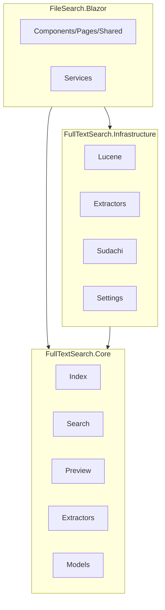
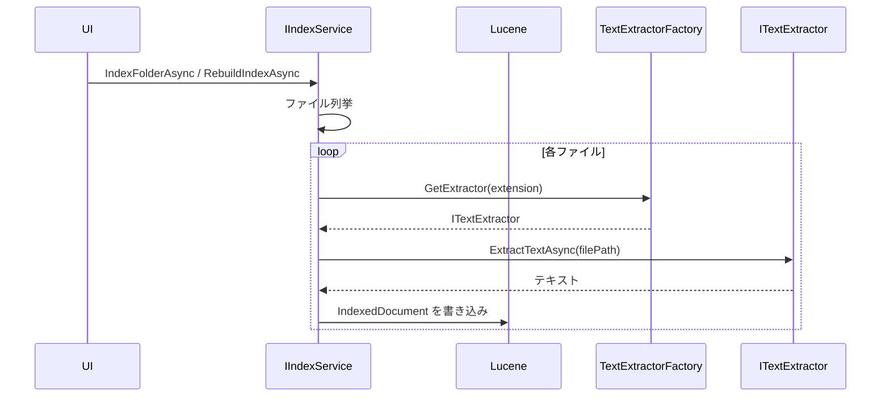
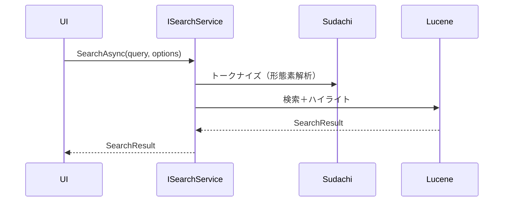
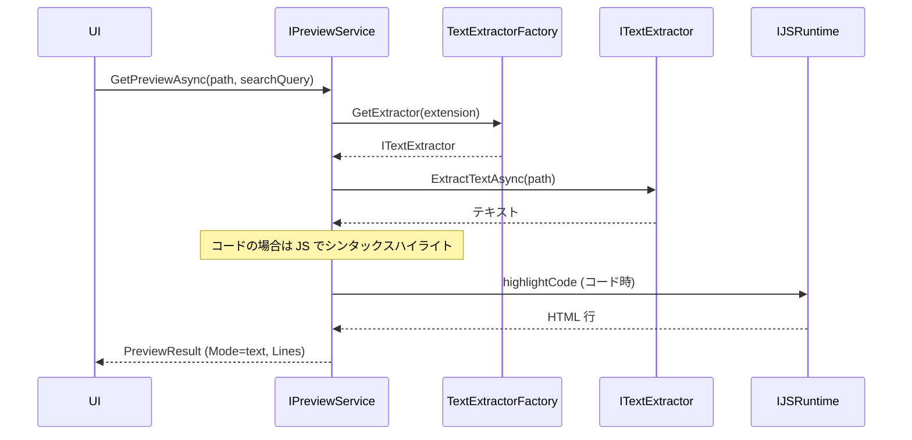

# 詳細設計書

## 1. はじめに

本ドキュメントは、社内ファイルサーバ向け全文検索システムの内部設計（モジュール構成・インターフェース・クラス・データ構造）を定義する。外部仕様は「外部設計書」を参照すること。

---

## 2. アーキテクチャ概要

### 2.1 レイヤー構成

- **FileSearch.Blazor**: UI 層。Blazor Hybrid (MAUI)。Core のインターフェースと Infrastructure の実装を DI で利用する。
- **FullTextSearch.Core**: インターフェース・モデル・共有ロジック。インフラに依存しない。
- **FullTextSearch.Infrastructure**: 検索・インデックス・抽出・設定の実装。Core を参照する。

### 2.2 依存関係

- Blazor → Core（ISearchService, IIndexService, IPreviewService, ITextExtractor, Models）
- Blazor → Infrastructure（IAppSettingsService および各実装クラス。MauiProgram で DI 登録）
- Infrastructure → Core（インターフェース・モデル・DefaultPaths 等）

---

## 3. モジュール一覧

### 3.1 FullTextSearch.Core

| 名前空間/フォルダ | 役割 | 主な型 |
|------------------|------|--------|
| Index | インデックス操作 | IIndexService, IndexProgress, IndexRebuildOptions, IndexStats |
| Search | 検索 | ISearchService, SearchOptions, SearchResult |
| Preview | プレビュー取得 | IPreviewService |
| Extractors | テキスト抽出の抽象 | ITextExtractor, PreviewCategory, TextExtractorFactory |
| Models | ドメインモデル | AppSettings, IndexedDocument, SearchResultItem, MatchHighlight, PreviewResult, PreviewLineResult |
| （ルート） | デフォルトパス | DefaultPaths |

### 3.2 FullTextSearch.Infrastructure

| 名前空間/フォルダ | 役割 | 主な型 |
|------------------|------|--------|
| Lucene | インデックス・検索実装 | LuceneIndexService, LuceneSearchService |
| Extractors | テキスト抽出実装 | OfficeExtractor, PdfExtractor, TextFileExtractor |
| Sudachi | 形態素解析 | SudachiAnalyzer, SudachiTokenizer, ListTokenStream |
| Settings | 設定の永続化 | AppSettingsService |

### 3.3 FileSearch.Blazor

| フォルダ | 役割 | 主なファイル |
|----------|------|--------------|
| Components/Pages | ページ | Home.razor, Home.razor.cs |
| Components/Shared | 共通コンポーネント | SearchSidebar, SearchResultTree, FilePreviewView, FolderListView, SettingsModal, IndexUpdateDialog, AppHeader 等 |
| Components/Layout | レイアウト | MainLayout.razor |
| Services | UI 用サービス | PreviewService, TreeBuilder |
| Platforms/Windows | Windows 固有 | マニフェスト・パッケージ定義 |
| wwwroot/css | スタイル | app.css, theme.css, sidebar.css 等 |

---

## 4. 主要インターフェース・クラス

### 4.1 インデックス（IIndexService）

**ファイル**: [FullTextSearch.Core/Index/IIndexService.cs](../src/FullTextSearch.Core/Index/IIndexService.cs)

| メソッド | 説明 |
|----------|------|
| InitializeAsync(indexPath, cancellationToken) | インデックスの初期化 |
| IndexDocumentAsync(document, cancellationToken) | 1 件追加/更新 |
| DeleteDocumentAsync(filePath, cancellationToken) | 1 件削除 |
| IndexFolderAsync(folderPath, progress, cancellationToken, progressOffset, progressTotalOverride) | フォルダ全体をインデックス |
| RebuildIndexAsync(folders, progress, options, cancellationToken) | 再構築（全削除＋全件追加） |
| UpdateIndexAsync(folders, progress, options, cancellationToken) | 差分更新 |
| GetStats() | 統計情報取得 |
| OptimizeAsync(cancellationToken) | インデックス最適化 |

**補助型**:
- **IndexProgress**: ProcessedFiles, TotalFiles, CurrentFile, ProgressPercent, ErrorCount
- **IndexRebuildOptions**: TargetExtensions（未指定時は抽出器の対応拡張子を使用）
- **IndexStats**: DocumentCount, LastUpdated, IndexSizeBytes

### 4.2 検索（ISearchService）

**ファイル**: [FullTextSearch.Core/Search/ISearchService.cs](../src/FullTextSearch.Core/Search/ISearchService.cs)

| メソッド | 説明 |
|----------|------|
| SearchAsync(query, options, cancellationToken) | 全文検索。SearchResult を返す |
| RefreshIndex() | インデックスキャッシュ破棄（パス変更時等） |
| Warmup() | 初回検索遅延軽減のため Reader/Analyzer を事前準備 |

**補助型**:
- **SearchOptions**: MaxResults, FileTypeFilter, DateFrom, DateTo, FolderFilter, SkipHighlights
- **SearchResult**: Items, TotalHits, ElapsedMilliseconds, Query

### 4.3 プレビュー（IPreviewService）

**ファイル**: [FullTextSearch.Core/Preview/IPreviewService.cs](../src/FullTextSearch.Core/Preview/IPreviewService.cs)

| メソッド | 説明 |
|----------|------|
| GetPreviewAsync(path, searchQuery, cancellationToken) | 指定パスのプレビューを取得。PreviewResult を返す |

**モデル**: [FullTextSearch.Core/Models/PreviewResult.cs](../src/FullTextSearch.Core/Models/PreviewResult.cs)  
- PreviewResult: Mode（text/html）, Lines, LineCount, Html  
- PreviewLineResult: Content, HasMatch

### 4.4 テキスト抽出（ITextExtractor）

**ファイル**: [FullTextSearch.Core/Extractors/ITextExtractor.cs](../src/FullTextSearch.Core/Extractors/ITextExtractor.cs)

| メンバ | 説明 |
|--------|------|
| SupportedExtensions | サポートする拡張子のリスト |
| PreviewCategory | Text / Office / Pdf |
| CanExtract(extension) | 指定拡張子をサポートするか |
| ExtractTextAsync(filePath, cancellationToken) | ファイルからテキストを抽出 |

**TextExtractorFactory**:  
- GetExtractor(extension): 拡張子に対応する抽出器を返す  
- GetAllSupportedExtensions(): 全抽出器の対応拡張子を重複なく返す  

### 4.5 設定（IAppSettingsService）

**ファイル**: [FullTextSearch.Infrastructure/Settings/IAppSettingsService.cs](../src/FullTextSearch.Infrastructure/Settings/IAppSettingsService.cs)（インターフェースは Infrastructure に定義。Core にはない）

| メンバ | 説明 |
|--------|------|
| Settings | 現在の AppSettings |
| LoadAsync(cancellationToken) | 設定を読み込み |
| SaveAsync(cancellationToken) | 設定を保存 |

### 4.6 主要モデル（Models）

| 型 | ファイル | 主なプロパティ |
|----|----------|----------------|
| AppSettings | [Models/AppSettings.cs](../src/FullTextSearch.Core/Models/AppSettings.cs) | TargetFolders, TargetExtensions, IndexPath, PreviewDelayMs（設定画面では未編集）, LastIndexUpdate, AutoRebuildIntervalMinutes, ThemeMode |
| IndexedDocument | [Models/IndexedDocument.cs](../src/FullTextSearch.Core/Models/IndexedDocument.cs) | FilePath, FileName, FolderPath, Content, FileSize, LastModified, FileType, IndexedAt |
| SearchResultItem | [Models/SearchResultItem.cs](../src/FullTextSearch.Core/Models/SearchResultItem.cs) | FilePath, FileName, FolderPath, FileSize, LastModified, FileType, Score, Highlights |
| MatchHighlight | 同上 | Text, HighlightStart, HighlightEnd |

---

## 5. データフロー（主要シナリオ）

### 5.1 インデックス作成

- 対象フォルダを走査し、拡張子に応じた ITextExtractor でテキスト抽出。
- IndexedDocument に FilePath, FileName, FolderPath, Content, FileSize, LastModified, FileType 等を設定し、Lucene に書き込む。

### 5.2 検索

- クエリを Sudachi でトークナイズ（モード C）し、Lucene で検索。
- ハイライト用にマッチ箇所を取得し、SearchResultItem の Highlights に格納。

### 5.3 プレビュー取得

- ファイルパスと検索クエリ（任意）を IPreviewService.GetPreviewAsync に渡す。
- 現状の PreviewService（Blazor）は、抽出器でテキストを取得し、常に Mode = "text"・行リスト（Lines）で返す。Office/PDF もテキスト抽出して行リストで表示。コードの場合は IJSRuntime で Highlight.js を呼びハイライトする。html モード・画像プレビューは UI 側に分岐はあるが、サービスからは返していない。

---

## 6. インデックス構造（Lucene）

**実装**: [FullTextSearch.Infrastructure/Lucene/LuceneIndexService.cs](../src/FullTextSearch.Infrastructure/Lucene/LuceneIndexService.cs)

### 6.1 フィールド名（定数）

| 定数名 | 値 | 用途 |
|--------|-----|------|
| FieldFilePath | "filepath" | ファイルフルパス（一意） |
| FieldFileName | "filename" | ファイル名 |
| FieldFolderPath | "folderpath" | フォルダパス |
| FieldContent | "content" | 抽出テキスト（検索対象。Sudachi でトークナイズ） |
| FieldFileSize | "filesize" | ファイルサイズ |
| FieldLastModified | "lastmodified" | 最終更新日時 |
| FieldFileType | "filetype" | ファイル種類（拡張子） |
| FieldIndexedAt | "indexedat" | インデックス登録日時 |

### 6.2 アナライザ

- **SudachiAnalyzer**（Sudachi モード C）を使用。
- アナライザを変更した場合、既存インデックスは互換性がなくなる。再構築が必要。

---

## 7. 設定・パスの定数

### 7.1 パス

| 用途 | 定義場所 | 値 |
|------|----------|-----|
| インデックス保存先（デフォルト） | [FullTextSearch.Core/DefaultPaths.cs](../src/FullTextSearch.Core/DefaultPaths.cs) | LocalApplicationData/FullTextSearch/Index |
| 設定ファイル | AppSettingsService | LocalApplicationData/FullTextSearch/settings.json |

### 7.2 設定の永続化

- JSON でシリアライズ。AppSettingsService が LoadAsync / SaveAsync で読み書きする。

---

## 8. 拡張子・プレビュー種別

### 8.1 抽出器別対応拡張子

| 抽出器 | 拡張子 | PreviewCategory |
|--------|--------|-----------------|
| OfficeExtractor | .docx, .xlsx, .pptx | Office |
| PdfExtractor | .pdf | Pdf |
| TextFileExtractor | .txt, .csv, .log, .md, .cs, .js, .ts, .jsx, .tsx, .py, .java, .cpp, .c, .h, .hpp, .pas, .dpr, .dpk, .html, .htm, .css, .scss, .sass, .less, .xml, .json, .yaml, .yml, .sql, .sh, .bat, .ps1, .ini, .cfg, .conf, .config, .gitignore, .env | Text |

※ 一覧の詳細は各 Extractor の SupportedExtensionSet を参照（[静的定義一覧](静的定義一覧.md) も参照）。

### 8.2 プレビュー種別と抽出器の対応

- **Text**: テキスト・ソースコードとして表示。TextFileExtractor が対応する拡張子。
- **Office**: Word/Excel/PowerPoint。OfficeExtractor が対応。Windows プレビューハンドラを使用。
- **Pdf**: PDF。PdfExtractor が対応。プレビューハンドラまたは別表示。

※ プレビュー種別と抽出器の拡張子が二重管理になっている課題は [静的定義一覧](静的定義一覧.md) に記載されている。

---

## 9. DI 登録（MauiProgram）

**ファイル**: [FileSearch.Blazor/MauiProgram.cs](../src/FileSearch.Blazor/MauiProgram.cs)

| サービス | 実装 | ライフサイクル |
|----------|------|----------------|
| ITextExtractor | OfficeExtractor, PdfExtractor, TextFileExtractor | Singleton |
| TextExtractorFactory | TextExtractorFactory | Singleton |
| IIndexService | LuceneIndexService | Singleton |
| ISearchService | LuceneSearchService | Singleton |
| IAppSettingsService | AppSettingsService | Singleton |
| IPreviewService | PreviewService（Blazor） | Scoped |

---

## 10. 参照ドキュメント

- [要件定義書](要件定義.md)
- [外部設計書](外部設計.md)
- [静的定義一覧](静的定義一覧.md)
- [README.md](../README.md)
