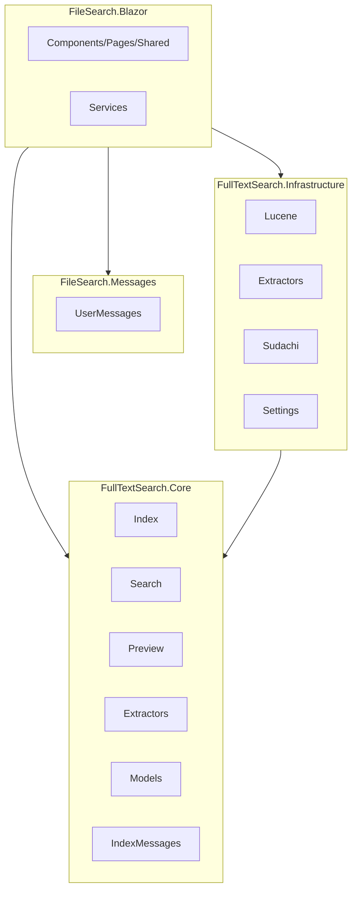
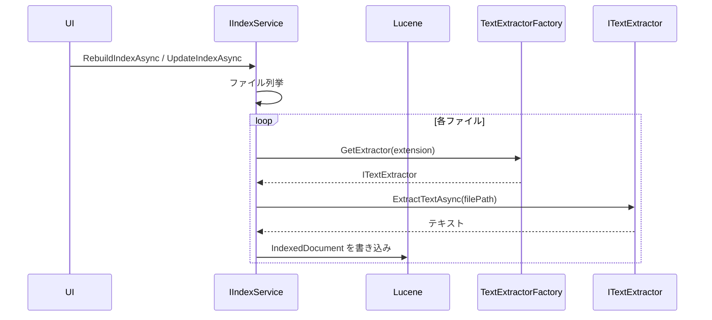
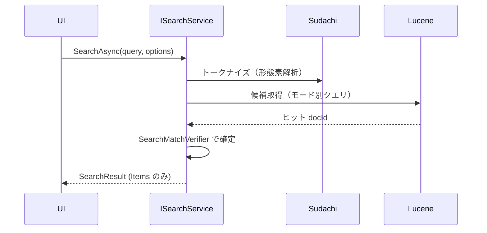
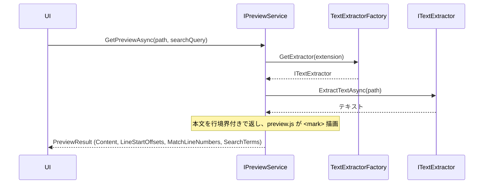

# 詳細設計書

## 1. はじめに

本ドキュメントは、Panoleon（社内ファイルサーバ向け全文検索システム）の内部設計（モジュール構成・インターフェース・クラス・データ構造）を定義する。外部仕様は「外部設計書」を参照すること。

---

## 2. アーキテクチャ概要

### 2.1 レイヤー構成

```mermaid
flowchart TB
  subgraph Blazor [FileSearch.Blazor]
    UI[Components/Pages/Shared]
    UISvc[Services]
  end
  subgraph Messages [FileSearch.Messages]
    UM[UserMessages]
  end
  subgraph Core [FullTextSearch.Core]
    Index[Index]
    Search[Search]
    Preview[Preview]
    Extractors[Extractors]
    Models[Models]
    IdxMsg[IndexMessages]
  end
  subgraph Infra [FullTextSearch.Infrastructure]
    Lucene[Lucene]
    ExtImpl[Extractors]
    Sudachi[Sudachi]
    Settings[Settings]
  end
  Blazor --> Core
  Blazor --> Infra
  Blazor --> Messages
  Infra --> Core
```

- **FileSearch.Blazor**: UI 層。Blazor Hybrid (MAUI)。Core のインターフェースと Infrastructure の実装を DI で利用する。画面文言は **FileSearch.Messages** を参照する。
- **FileSearch.Messages**: 画面向けユーザー文言のみを集約した小さなプロジェクト（`UserMessages`）。Core の `IndexMessages`（インデックス・ログ）と役割を分ける。
- **FullTextSearch.Core**: インターフェース・モデル・共有ロジック。インフラに依存しない。
- **FullTextSearch.Infrastructure**: 検索・インデックス・抽出・設定の実装。Core を参照する。

### 2.2 依存関係

- Blazor → Core（ISearchService, IIndexService, IPreviewService, ITextExtractor, Models）
- Blazor → Infrastructure（IAppSettingsService, IAppModeService および各実装クラス。MauiProgram で DI 登録）
- Blazor → FileSearch.Messages（`UserMessages`。プロジェクト参照）
- Infrastructure → Core（インターフェース・モデル・DefaultPaths 等）
- Tests → Core / Infrastructure / FileSearch.Messages（単体テスト）

---

## 3. モジュール一覧

### 3.1 FullTextSearch.Core

| 名前空間/フォルダ | 役割 | 主な型 |
|------------------|------|--------|
| Index | インデックス操作 | IIndexService, IndexProgress, IndexRebuildOptions, SkippedFileEntry |
| Search | 検索 | ISearchService, SearchOptions, SearchResult, SearchMode |
| Preview | プレビュー取得 | IPreviewService, PreviewHelper, ContentPreviewHelper |
| Extractors | テキスト抽出の抽象 | ITextExtractor, TextExtractorFactory |
| Models | ドメインモデル | AppSettings, IndexedDocument, SearchResultItem, PreviewResult |
| UI | ツリー・表示フォーマット | TreeBuilder, TreeNode, DisplayFormatters, FolderTableColumnLayout |
| （ルート） | 上限・デフォルトパス・インデックス系文言 | ContentLimits, DefaultPaths, AutoRebuildSchedule, **IndexMessages** |

### 3.2 FullTextSearch.Infrastructure

| 名前空間/フォルダ | 役割 | 主な型 |
|------------------|------|--------|
| Lucene | インデックス・検索実装 | LuceneIndexService, LuceneSearchService |
| Extractors | テキスト抽出実装 | OfficeExtractor（`DocumentFormat.OpenXml`）, PdfExtractor（`PdfPig`）, MsgExtractor（`MsgReader`）, TextFileExtractor（`UtfUnknown`） |
| Sudachi | 形態素解析（ネイティブ） | SudachiAnalyzer, SudachiTokenizer, SudachiNative, ListTokenStream |
| Settings | 設定の永続化・動作モード | AppSettingsService, AppModeService, IAppModeService |

### 3.3 FileSearch.Blazor

| フォルダ | 役割 | 主なファイル |
|----------|------|--------------|
| Components/Pages | メイン画面（1 ページを partial で分割） | `Home.razor`（マークアップ）、`Home.razor.cs`（状態・ライフサイクル・Dispose・テーマ）、`Home.Search.cs`（検索・閲覧モード復帰）、`Home.Browse.cs`（閲覧ツリー読み込み）、`Home.Tree.cs`（ツリー操作・ファイル選択）、`Home.FolderList.cs`（右ペイン一覧）、`Home.Preview.cs`（プレビュー・ハイライトナビ）、`Home.Index.cs`（インデックス再構築・差分・進捗）、`Home.Settings.cs`（設定モーダル）、`Home.LoadingEta.cs`（構築 ETA） |
| Components/Shared | 共通コンポーネント | SearchSidebar, SearchResultTree, FilePreviewView, FolderListView, SettingsModal, IndexUpdateDialog, AppHeader 等 |
| Components/Layout | レイアウト | MainLayout.razor |
| Services | UI 用サービス | PreviewService, PreviewJsInterop |
| Platforms/Windows | WinUI 起動・二重起動防止 | App.xaml.cs, SingleInstanceGuard |
| Platforms/Windows | Windows 固有 | マニフェスト・パッケージ定義 |
| wwwroot/css | スタイル | app.css, theme.css, sidebar.css 等 |

- **起動・ウィンドウタイトル**: `App.xaml.cs` / `MainPage.xaml.cs` で `Window.Title` / `ContentPage.Title = AppWindowTitle.Current`（例: **`Panoleon v2.0`**。`UserMessages.AppTitle` + major.minor）。読み仮名表記はない
- **プレビュー**: FilePreviewView は行リスト表示のみ（html モードは廃止）。`Home.Preview.cs` の `SchedulePreviewLoad` が **200ms**（`Home.razor.cs` の `PreviewDebounceMs`）デバウンス後に `LoadPreview` を実行。
- **インデックス構築のキャンセル**: `Home.Index.cs` の `RunIndexUpdateAsync` 等で CancellationTokenSource を保持し、RebuildIndexAsync / UpdateIndexAsync に token を渡す。フッターに「キャンセル」ボタンを表示し、押下で Cancel を呼ぶ。OperationCanceledException 時は進捗テキストを「キャンセルしました」に更新する。進捗表示には IndexProgress.CurrentFile を含め、処理中のファイル名を表示する。
- **キャンセル時のロールバック**: `LuceneIndexService` の `RebuildIndexAsync` / `UpdateIndexAsync` は `OperationCanceledException` を捕捉し、`IndexWriter.Rollback()` で未コミットの変更を破棄してから IndexWriter を同じパスで再オープンする（`RollbackAndReopenAsync`）。これにより、差分更新／再構築をキャンセルしてもインデックスは最後の Commit 時点の整合状態に戻り、中途半端な内容が永続化されることはない。
- **スキップ通知**: インデックス完了後、`IndexService.LastSkippedFiles` に 1 件以上あれば件数を SearchSidebar のフッターに警告色で表示する。
- **領域別ズーム（Ctrl + ホイール）**: `wwwroot/index.html` の IIFE で `wheel` イベントを `capture: true, passive: false` で捕捉し、`e.ctrlKey` 時は `preventDefault` で WebView2 既定の全体ズームを抑止する。`e.target.closest('.sidebar')` / `closest('.main-content')` で対象領域を判定し、`:root` の CSS 変数 `--zoom-sidebar` / `--zoom-main` を更新（`wwwroot/css/layout.css` で `.sidebar` / `.main-content` に `zoom: var(...)` を適用、Chromium の `zoom` プロパティを使用）。倍率は 0.5〜3.0 に 10% 刻みでクランプし、**永続化しない**（アプリ再起動・WebView 再読み込みで等倍復帰）。`Ctrl+0` でフォーカス側の領域を等倍にリセット。
- **起動スプラッシュ**: `wwwroot/index.html` のブート画面。テーマ（settings / localStorage）と連動し、最低 **3 秒**表示後に `hideBootSplash` で非表示。
- **appmode 同期**: `appmode.json` / `shared.json` を **60 秒**ごとに再読み込み。変更があった場合のみ `IAppModeService` 経由でインデックス再初期化・フォルダツリー更新。

### 3.4 FileSearch.Messages

| 項目 | 内容 |
|------|------|
| 役割 | 画面 UI のユーザー向け文言の一元定義（`UserMessages`） |
| 主なファイル | [UserMessages.cs](../src/FileSearch.Messages/UserMessages.cs) |
| 参照 | [メッセージ一覧.md](メッセージ一覧.md)（ID・表示箇所との対応） |

- インデックス処理・スキップログ・Lucene `filetype` 表示名は **Core の `IndexMessages`** にあり、本プロジェクトとは分離している。

---

## 4. 主要インターフェース・クラス

### 4.1 インデックス（IIndexService）

**ファイル**: [FullTextSearch.Core/Index/IIndexService.cs](../src/FullTextSearch.Core/Index/IIndexService.cs)

| メソッド | 説明 |
|----------|------|
| InitializeAsync(indexPath, readOnly, cancellationToken) | インデックスの初期化。`readOnly: true` のとき IndexWriter を開かない |
| LastInitializeFailed | 直近の初期化が失敗したか |
| RebuildIndexAsync(folders, progress, options, cancellationToken) | 再構築（全削除＋全件追加）。キャンセル時はロールバック |
| UpdateIndexAsync(folders, progress, options, cancellationToken) | 差分更新。対象外フォルダ配下の削除も含む。キャンセル時はロールバック |
| LastSkippedFiles | 直近操作でスキップされたファイル（パスと理由） |
| ListIndexedItems(targetFolders, targetExtensions) | インデックス済みファイル一覧（閲覧ツリー・件数表示用） |

**補助型**:
- **IndexProgress**: ProcessedFiles, TotalFiles, CurrentFile, ErrorCount, NoChanges
- **IndexRebuildOptions**: TargetExtensions（未指定時は抽出器の対応拡張子を使用）

### 4.2 検索（ISearchService）

**ファイル**: [FullTextSearch.Core/Search/ISearchService.cs](../src/FullTextSearch.Core/Search/ISearchService.cs)

| メソッド | 説明 |
|----------|------|
| SearchAsync(query, options, progress, cancellationToken) | 全文検索。SearchResult を返す |
| RefreshIndex() | インデックスキャッシュ破棄（パス変更時等） |
| Warmup() | 初回検索遅延軽減のため Reader/Analyzer を事前準備 |
| TryGetStoredContentAsync / TryGetContentPreviewsAsync | インデックス本文・一覧用抜粋の取得 |
| GetHighlightTerms(query, mode) | プレビューハイライト用検索語 |

**補助型**:
- **SearchOptions**: MaxResults, SearchMode（Keyword / Any / Phrase）
- **SearchResult**: Items（`List<SearchResultItem>`）のみ

### 4.3 プレビュー（IPreviewService）

**ファイル**: [FullTextSearch.Core/Preview/IPreviewService.cs](../src/FullTextSearch.Core/Preview/IPreviewService.cs)

| メソッド | 説明 |
|----------|------|
| GetPreviewAsync(path, searchQuery, cancellationToken) | 指定パスのプレビューを取得。PreviewResult を返す |

**モデル**: [FullTextSearch.Core/Models/PreviewResult.cs](../src/FullTextSearch.Core/Models/PreviewResult.cs)  
- PreviewResult: Content, LineStartOffsets, MatchLineNumbers, IsError, SearchTerms。描画は Blazor 側 `preview.js` が担当

### 4.4 テキスト抽出（ITextExtractor）

**ファイル**: [FullTextSearch.Core/Extractors/ITextExtractor.cs](../src/FullTextSearch.Core/Extractors/ITextExtractor.cs)

| メンバ | 説明 |
|--------|------|
| SupportedExtensions | サポートする拡張子のリスト |
| CanExtract(extension) | 指定拡張子をサポートするか |
| ExtractTextAsync(filePath, cancellationToken) | ファイルからテキストを抽出 |

**TextExtractorFactory**:  
- GetExtractor(extension): 拡張子に対応する抽出器を返す  
- GetAllSupportedExtensions(): 全抽出器の対応拡張子を重複なく返す  

### 4.5 動作モード（IAppModeService）

**ファイル**: [FullTextSearch.Infrastructure/Settings/IAppModeService.cs](../src/FullTextSearch.Infrastructure/Settings/IAppModeService.cs)

| メンバ | 説明 |
|--------|------|
| IsAdmin | 管理者モードか（`appmode.json` の mode 等から判定） |
| SharedIndexPath / SharedTargetFolders | 共有設定からのインデックスパス・対象フォルダ |
| SharedConfigPath | `shared.json` の UNC パス |
| Initialize() | 起動時に `appmode.json` と `sharedConfig` を読み込み |
| TrySaveSharedConfig | 管理者保存時に `shared.json` へ `indexPath` + `targetFolders` を書き込み |

### 4.6 設定（IAppSettingsService）

**ファイル**: [FullTextSearch.Infrastructure/Settings/IAppSettingsService.cs](../src/FullTextSearch.Infrastructure/Settings/IAppSettingsService.cs)（インターフェースは Infrastructure に定義。Core にはない）

| メンバ | 説明 |
|--------|------|
| Settings | 現在の AppSettings |
| LoadAsync(cancellationToken) | 設定を読み込み |
| SaveAsync(cancellationToken) | 設定を保存 |

### 4.7 主要モデル（Models）

| 型 | ファイル | 主なプロパティ |
|----|----------|----------------|
| AppSettings | [Models/AppSettings.cs](../src/FullTextSearch.Core/Models/AppSettings.cs) | TargetFolders, TargetExtensions, IndexPath, LastIndexUpdate, AutoRebuildDailyHours, ThemeMode |
| IndexedDocument | [Models/IndexedDocument.cs](../src/FullTextSearch.Core/Models/IndexedDocument.cs) | FilePath, FileName, FolderPath, Content, FileSize, LastModified, FileType, IndexedAt |
| SearchResultItem | [Models/SearchResultItem.cs](../src/FullTextSearch.Core/Models/SearchResultItem.cs) | FilePath, FileName, FolderPath, FileSize, LastModified |

---

## 5. データフロー（主要シナリオ）

### 5.1 インデックス作成

```mermaid
sequenceDiagram
  participant UI
  participant IIndex as IIndexService
  participant Lucene
  participant Factory as TextExtractorFactory
  participant Ext as ITextExtractor
  UI->>IIndex: RebuildIndexAsync / UpdateIndexAsync
  IIndex->>IIndex: ファイル列挙
  loop 各ファイル
    IIndex->>Factory: GetExtractor(extension)
    Factory-->>IIndex: ITextExtractor
    IIndex->>Ext: ExtractTextAsync(filePath)
    Ext-->>IIndex: テキスト
    IIndex->>Lucene: IndexedDocument を書き込み
  end
```

- 対象フォルダを走査し、**抽出器対応拡張子のみ**列挙する（`settings.json` に残った非対応拡張子は設定読込時・再構築時の両方で除外）。`bin` / `obj` / `node_modules` / `.git` 等のビルド・システムフォルダはスキップする。
- 拡張子に応じた ITextExtractor でテキスト抽出。
- IndexedDocument に FilePath, FileName, FolderPath, Content, FileSize, LastModified, FileType 等を設定し、Lucene に書き込む。
- **サイズ超過スキップ**: `ContentLimits.IndexMaxFileBytesForExtract`（**1MB**）を超えるファイルは本文抽出・登録を行わずスキップ。
- **本文**: 1MB 以下のファイルは抽出全文を Lucene 保存・Sudachi トークン化・バイグラム・プレビューに使用（文字数打ち切りなし）。
- **並列チャンク処理**: `ProcessChunkAsync` でチャンク内ファイルを並列抽出し、抽出失敗（null）のファイルをスキップログに記録、成功分のみ Lucene に一括追加。Lucene 書き込み失敗時もスキップ件数に加算。
- **スキップログ出力**: 再構築・差分更新の完了後、`WriteSkippedLog` でインデックスフォルダ内に `skipped_files.log` を出力。UI には件数メッセージ（`{N} 件がスキップされました`）のみを表示し、ログファイルのパスは画面上に出さない。当該行のクリックで `skipped_files.log` を既定アプリで開く。

### 5.2 検索

```mermaid
sequenceDiagram
  participant UI
  participant ISearch as ISearchService
  participant Sudachi
  participant Lucene
  UI->>ISearch: SearchAsync(query, options)
  ISearch->>Sudachi: トークナイズ（形態素解析）
  ISearch->>Lucene: 候補取得（モード別クエリ）
  Lucene-->>ISearch: ヒット docId
  ISearch->>ISearch: SearchMatchVerifier で確定
  ISearch-->>UI: SearchResult (Items のみ)
```

- クエリを Sudachi でトークナイズ（モード C）し、`SearchMode`（AND / OR / 完全一致）に応じて Lucene で候補を取得・確定する。
- 返却は `SearchResult.Items`（`SearchResultItem` のメタデータのみ）。スコア・ハイライト抜粋は含めない（一覧「内容」列・プレビューは `TryGetContentPreviewsAsync` / `GetPreviewAsync` で別取得）。

### 5.3 プレビュー取得

```mermaid
sequenceDiagram
  participant UI
  participant IPreview as IPreviewService
  participant Factory as TextExtractorFactory
  participant Ext as ITextExtractor
  UI->>IPreview: GetPreviewAsync(path, searchQuery)
  IPreview->>Factory: GetExtractor(extension)
  Factory-->>IPreview: ITextExtractor
  IPreview->>Ext: ExtractTextAsync(path)
  Ext-->>IPreview: テキスト
  Note over IPreview: 本文を行境界付きで返し、preview.js が <mark> 描画
  IPreview-->>UI: PreviewResult (Content, LineStartOffsets, MatchLineNumbers, SearchTerms)
```

- ファイルパスと検索クエリ（任意）を IPreviewService.GetPreviewAsync に渡す。
- PreviewService（Blazor）は抽出テキストと行境界を `PreviewResult`（`Content`, `LineStartOffsets`, `MatchLineNumbers`, `IsError`, `SearchTerms`）で返し、`preview.js` が WinMerge 風に描画する。UI では `SchedulePreviewLoad` が **200ms** デバウンス後に読み込む。

---

## 6. インデックス構造（Lucene）

**実装**: [FullTextSearch.Infrastructure/Lucene/LuceneIndexService.cs](../src/FullTextSearch.Infrastructure/Lucene/LuceneIndexService.cs)

### 6.1 フィールド名（定数）

| 定数名 | 値 | 用途 |
|--------|-----|------|
| FieldFilePath | "filepath" | ファイルフルパス（一意） |
| FieldFileName | "filename" | ファイル名 |
| FieldFolderPath | "folderpath" | フォルダパス |
| FieldContent | "content" | 抽出テキスト（検索対象。Sudachi でトークナイズ） |
| FieldFileSize | "filesize" | ファイルサイズ |
| FieldLastModified | "lastmodified" | 最終更新日時 |
| FieldFileType | "filetype" | ファイル種類の表示名（`IndexMessages.GetFileTypeDisplayName` による日本語ラベル。例: Word文書、PDFファイル） |
| FieldIndexedAt | "indexedat" | インデックス登録日時 |

### 6.2 アナライザ

- **SudachiAnalyzer**（Sudachi モード C）を使用。
- アナライザを変更した場合、既存インデックスは互換性がなくなる。再構築が必要。

### 6.3 Sudachi ネイティブ（SudachiTokenizer / SudachiNative）

- **SudachiAnalyzer**（Sudachi モード C）を Lucene のアナライザとして使用する。
- **SudachiNative** が `sudachi_ffi.dll`（sudachi.rs v0.6.11）を P/Invoke で呼び出す。辞書・設定は `sudachi/resources/` に配置し、publish 時に同梱する。
- **スレッドモデル**: Sudachi Tokenizer はスレッドセーフではないため、`ThreadLocal` でスレッドごとにコンテキストを保持する。`Warmup()` で DLL・辞書を事前ロードする。
- **並列度**: `SudachiTokenizer.PoolSize`（`max(2, min(8, ProcessorCount/2))`）をインデックス構築の `Parallel.ForEach` 並列度に使用する。
- **フォールバック**: トークン化失敗時や immense term 対策として、UTF-8 32765 バイト以下に分割して Lucene に渡す。
- アナライザを変更した場合、既存インデックスは互換性がなくなる。再構築が必要。

## 7. 設定・パスの定数

### 7.1 パス

| 用途 | 定義場所 | 値 |
|------|----------|-----|
| インデックス保存先（デフォルト） | [FullTextSearch.Core/DefaultPaths.cs](../src/FullTextSearch.Core/DefaultPaths.cs) | LocalApplicationData/FullTextSearch/Index |
| 設定ファイル | AppSettingsService | LocalApplicationData/FullTextSearch/settings.json |

### 7.2 設定の永続化

- JSON でシリアライズ。AppSettingsService が LoadAsync / SaveAsync で読み書きする。

---

## 8. 拡張子・抽出器

### 8.1 抽出器別対応拡張子

| 抽出器 | 拡張子 |
|--------|--------|
| OfficeExtractor | .docx, .xlsx, .pptx |
| MsgExtractor | .msg |
| PdfExtractor | .pdf |
| TextFileExtractor | .txt, .csv, .log, .md, .cs, .js, .ts, .jsx, .tsx, .py, .java, .cpp, .c, .h, .hpp, .pas, .dpr, .dpk, .html, .htm, .css, .scss, .sass, .less, .xml, .json, .yaml, .yml, .sql, .sh, .bat, .ps1, .ini, .cfg, .conf, .config, .gitignore, .env |

※ 一覧の詳細は各 Extractor の SupportedExtensionSet を参照（[静的定義一覧](静的定義一覧.md) も参照）。

### 8.2 プレビュー表示

- すべての対応形式は **テキスト抽出の行表示**（`PreviewResult` + `preview.js`）。表形式・ネイティブプレビュー・シンタックスハイライトは行わない。
- 拡張子の正規化・アイコン分類は `PreviewHelper`（`NormalizeExtension`, `GetFileIconClass`）および `DisplayFormatters.GetFileIconClass` を使用。
- **利用ライブラリ補足**: OfficeExtractor は `DocumentFormat.OpenXml`、PdfExtractor は `PdfPig`、MsgExtractor は `MsgReader`、TextFileExtractor の文字コード判定は `UtfUnknown`。

---

## 9. DI 登録（MauiProgram）

**ファイル**: [FileSearch.Blazor/MauiProgram.cs](../src/FileSearch.Blazor/MauiProgram.cs)

| サービス | 実装 | ライフサイクル |
|----------|------|----------------|
| ITextExtractor | OfficeExtractor, PdfExtractor, MsgExtractor, TextFileExtractor | Singleton |
| TextExtractorFactory | TextExtractorFactory | Singleton |
| IIndexService | LuceneIndexService | Singleton |
| ISearchService | LuceneSearchService | Singleton |
| IAppSettingsService | AppSettingsService | Singleton |
| IAppModeService | AppModeService | Singleton |
| IPreviewService | PreviewService（Blazor） | Scoped |

---

## 10. 参照ドキュメント

- [要件定義書](要件定義.md)
- [外部設計書](外部設計.md)
- [静的定義一覧](静的定義一覧.md)
- [README.md](../README.md)
