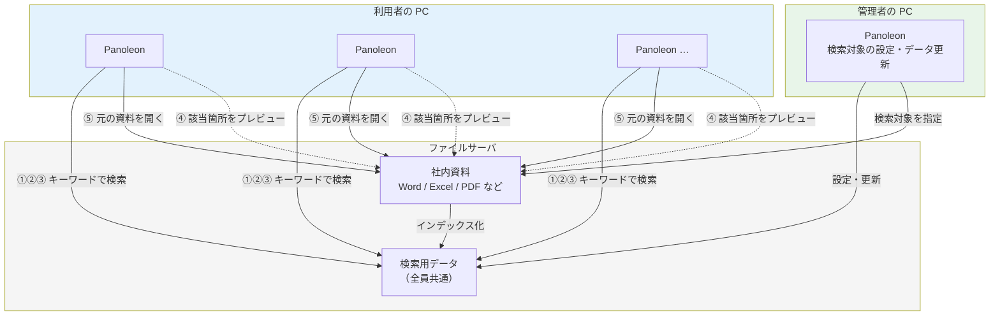

# プレゼン構成（案）

**全文検索システム「Panoleon - v2.0」**

---

## 聴衆・トーン

| 項目 | 方針 |
|------|------|
| **聴衆** | 同部署の SE 約50名 |
| **説明の前提** | 職種は SE だが、Panoleon 自体は初めて聞く人がほとんどと想定する |
| **トーン** | 専門用語は最小限にし、「何ができて、どう使うか」を中心に説明する |
| **生成AIの扱い** | 開発で生成AIを活用したことは**言ってよい**。ただし主役は製品と仕様であり、「AIが全部作った」ではなく「仕様を基準に、生成AIも開発支援として活用した」という伝え方にする |
| **言及しないこと** | 特定のエディタ名・自宅環境など、社外公開 NG の話題。製品内部の技術スタック名（検索エンジン・ライブラリ名など） |
| **技術の出し方** | 製品の内部技術はスライドに載せない。口頭も本編では使わない（Q&A で聞かれたときだけ） |

> **発表の心がけ**  
> 「開発の裏話」より「このツールで何が楽になるか」を前面に。技術詳細は聞かれたときだけ補足する。

---

## 1. はじめに

| 項目 | 内容 |
|------|------|
| **目的** | 発表のテーマと全体像を簡単に伝える |
| **内容** | ・本日の発表テーマ<br>・Panoleon - v2.0 とは何か（一言で）<br>・説明する内容の流れ |
| **位置づけ** | 聞き手に「これから何を説明するのか」を共有する導入部分 |

**一言例**

> ファイルサーバ内の Word・Excel・PDF などを、キーワードで横断検索できる Windows アプリです。

---

## 2. システム全体イメージの紹介

| 項目 | 内容 |
|------|------|
| **目的** | 最初に概要図と実際の画面を見せ、完成形をイメージしてもらう |
| **内容** | ・**システム概要図（1スライド）** ← 下記「システム概要図」参照<br>・検索バー（キーワード入力）<br>・左：検索結果ツリー（フォルダ単位）<br>・右：プレビュー（該当箇所のハイライト表示）<br>・「開く」「フォルダ」ボタンで対象資料へアクセス |
| **位置づけ** | 詳細説明の前に、「どのようなシステムか」を直感的に理解してもらうパート |

> **補足（発表時）**  
> Panoleon は画面が分かれているのではなく、1画面内の3ペイン構成。ハイライト行の「次へ」「前へ」ナビゲーションも見せると伝わりやすい。  
> **技術要素（検索エンジン名・ライブラリ名など）はスライドにも口頭にも出さない。**

**ここで軽く触れてよい運用の話**

- 管理者が検索対象フォルダを設定し、全員が同じ検索データを参照する
- 利用者はインストールして起動するだけ（個別設定は不要）

---

## 3. 開発背景と目的

| 項目 | 内容 |
|------|------|
| **目的** | なぜこのシステムが必要だったのかを説明する |
| **内容** | ・情報を探すのに時間がかかっていた<br>・資料やナレッジを十分に活用しきれていなかった<br>・情報の所在や経緯が特定の人に依存しやすかった<br>・必要な情報へ素早くアクセスできる仕組みが必要だった |
| **位置づけ** | システム開発の必要性を伝えるパート |

> **聴衆への刺さり方**  
> SE なら「あのフォルダどこだっけ」「誰か知ってる人いない？」に共感しやすい。日常の探し物エピソードを1つ入れるとよい。

---

## 4. 開発方針・進め方

| 項目 | 内容 |
|------|------|
| **目的** | 要件と仕様を起点に、生成AIも活用しながら段階を踏んで開発した流れを伝える |
| **内容** | ・要件定義を作成<br>・要件定義をもとに、生成AIを活用して試作品を作成<br>・試作品を参考に、基本設計を作成<br>・基本設計に基づき、生成AIを活用して実装<br>・基本設計に基づき、生成AIを活用してテスト仕様書を作成<br>・テストにより、仕様どおりに動作することを確認<br>・最終的な品質確認を実施 |
| **位置づけ** | 生成AIを開発支援として活用しつつ、要件・設計・動作確認を重視したことを示すパート。**短く（2〜3枚）** |
| **補足** | 「AIで作った」より「仕様や期待する振る舞いを基準に開発した」ことを前面に。ツール名・エディタ名は出さない |

**伝え方の例（1文）**

> 要件と基本設計を先に固め、その上で生成AIを開発支援に使いながら、試作品・実装・テストまで進めました。

> **この章の扱い**  
> 同部署の SE 向けなので、生成AIの活用は正直に話してよい。ただし章全体は短く、主役はあくまで 5章のデモ。

---

## 5. 主な機能とデモ

| 項目 | 内容 |
|------|------|
| **目的** | 実際の利用シーンに沿って、機能を具体的に見せる |
| **内容** | ・キーワード検索<br>・検索結果の一覧表示（ツリー）<br>・該当箇所のプレビューとハイライト<br>・対象資料・フォルダへのアクセス<br>・対応ファイル形式（Word / Excel / PDF など） |
| **デモの流れ** | ① キーワードを入力 → ② 検索結果を確認 → ③ 該当箇所を確認 → ④ 対象資料を開く |
| **位置づけ** | **発表の中心パート**。2章で見せた全体像を、実際の操作として詳しく説明する |

**デモ例（1シナリオに統一）**

> 過去の見積書で特定の条件を探したい  
> キーワード入力 → ツリーで絞り込み → プレビューで該当行確認 → 元ファイルを開く

**デモの注意**

- 事前にヒットするキーワードを用意しておく
- 日本語の部分一致が効くことを見せる
- エクスプローラでフォルダを掘る手間との対比を意識する

---

## 6. 期待される効果

| 項目 | 内容 |
|------|------|
| **目的** | このシステムによって期待される効果を整理する |
| **内容** | ・情報検索時間の短縮<br>・ナレッジ活用の促進<br>・問い合わせや確認作業の削減<br>・属人化の軽減<br>・新任者、異動者の立ち上がり支援<br>・今後、利用状況を確認しながら効果を検証 |
| **位置づけ** | 現時点で想定されるシステムの価値を伝え、今後の効果測定につなげるパート |

**Before / After の例**

| Before | After |
|--------|-------|
| フォルダを開き、ファイル名や中身を手作業で確認 | キーワード1つでファイルサーバ横断検索 |

---

## 7. 今後の改善方針

| 項目 | 内容 |
|------|------|
| **目的** | 現時点での完成で終わりではなく、機能面と運用面の両方から、継続的に改善していく方針を伝える |
| **内容** | ・検索対象の拡大<br>・検索速度の向上<br>・検索精度の向上<br>・画面の使いやすさ改善<br>・権限管理の強化<br>・検索結果の要約機能の検討<br>・保守しやすい開発・運用プロセスの整備<br>・社内環境で継続的に改善できる仕組みづくり |
| **位置づけ** | 機能改善だけでなく、今後も継続して活用・改善していくための方向性を示すパート |
| **補足** | 権限は現状（ファイルサーバの既存権限に依存）と将来（強化）を分けて説明する |

---

## 8. まとめ・質疑応答

| 項目 | 内容 |
|------|------|
| **目的** | 発表全体を簡潔に振り返り、質疑につなげる |
| **内容** | ・Panoleon - v2.0 は情報検索を効率化する全文検索システム<br>・必要な情報へ素早くアクセスできる仕組みを整備<br>・仕様と動作確認を重視し、生成AIも活用して開発を推進<br>・今後も改善を重ね、より使いやすい情報活用基盤を目指す |
| **位置づけ** | 発表内容を締めくくるパート |

**想定されやすい質問（SE向け）**

| 質問 | 答えの方向 |
|------|-----------|
| リアルタイムで更新される？ | 定期再構築。ファイル変更の即時反映ではない |
| 何が検索できる？ | Word / Excel / PowerPoint / PDF / テキスト / ソースコード など |
| 自分のPCに検索データがある？ | ファイルサーバ上の共通データを参照（全員同じ） |
| 権限は？ | ファイルサーバの既存アクセス権に準拠 |
| インストール方法は？ | MSIX または ZIP 配布（詳細は別途） |

---

## 構成上の狙い

- 冒頭で**概要図1枚**と実際の画面を見せ、完成形を先にイメージしてもらう
- 背景は「探し物の課題」に寄せ、SE ならではの共感を引く
- 開発プロセスは短く。生成AIの活用は伝えつつ、主役はデモと利用イメージ
- 効果と今後の方針で前向きに締める
- 製品の内部技術・特定ツール名・社外環境の話は出さない（生成AIの活用自体は OK）

---

## 時間配分の目安（例：30分）

| 章 | 目安 | 備考 |
|----|------|------|
| 1. はじめに | 2分 | |
| 2. 全体イメージ | 5分 | 画面を見せる |
| 3. 背景 | 3分 | |
| 4. 開発の進め方 | 2分 | 短く |
| 5. デモ | 12分 | **中心** |
| 6. 効果 | 3分 | |
| 7. 今後 | 2分 | |
| 8. まとめ・Q&A | 残り | |

---

## システム概要図（1スライド）

2章の冒頭、または1章の直後に使う。**1枚で全体像が伝わること**を優先し、技術用語は載せない。

### スライドに載せる文言（コピー用）

**タイトル**

```
Panoleon v2.0　システム概要
```

**キャッチ（タイトル下・1行）**

```
ファイルサーバ内の資料を、キーワードひとつで横断検索できる
```

**3つのブロック（図のラベル）**

| ブロック | ラベル | 補足（小さく） |
|----------|--------|----------------|
| 上 | **利用者の PC** | Panoleon を起動 → 検索・プレビュー・ファイルを開く |
| 中 | **ファイルサーバ** | 社内資料（Word / Excel / PDF など）＋ 検索用データ（全員共通） |
| 下 | **管理者の PC** | 検索対象フォルダの設定・検索用データの更新 |

**利用の流れ（図の右または下に番号付き）**

```
① キーワード入力  →  ② 検索  →  ③ 該当ファイルを一覧  →  ④ 該当箇所を確認  →  ⑤ 元の資料を開く
```

**脚注（1行・任意）**

```
検索用データは管理者が更新。ファイルの追加・変更は定期反映（即時ではない）。
```

---

### 図のレイアウト（PowerPoint 用・ASCII）

スライド上では矢印と3色の箱で表現する想定。

```
┌──────────────────────────────────────────────────────────────────────┐
│  Panoleon v2.0　システム概要                                          │
│  ファイルサーバ内の資料を、キーワードひとつで横断検索できる              │
├──────────────────────────────────────────────────────────────────────┤
│                                                                       │
│   ┌─────────┐  ┌─────────┐  ┌─────────┐                            │
│   │利用者 PC │  │利用者 PC │  │利用者 PC │  …                       │
│   │ Panoleon│  │ Panoleon│  │ Panoleon│                            │
│   └────┬────┘  └────┬────┘  └────┬────┘                            │
│        │  検索・プレビュー・ファイルを開く  │                          │
│        └──────────────┼──────────────┘                               │
│                       ▼                                               │
│   ┌─────────────────────────────────────────────┐                  │
│   │            ファイルサーバ                      │                  │
│   │  ┌──────────────────┐   ┌─────────────────┐  │                  │
│   │  │ 社内資料          │   │ 検索用データ      │  │                  │
│   │  │ Word / Excel /   │──▶│ （全員が参照）    │  │                  │
│   │  │ PDF など          │   │                  │  │                  │
│   │  └────────▲─────────┘   └────────▲────────┘  │                  │
│   └───────────┼───────────────────────┼──────────┘                  │
│               │  元ファイルを開く      │  設定・更新                   │
│   ┌───────────┴───────────────────────┴──────────┐                  │
│   │  管理者 PC　 Panoleon                          │                  │
│   │  検索対象フォルダの設定 ／ 検索用データの更新    │                  │
│   └────────────────────────────────────────────────┘                  │
│                                                                       │
│   ①入力 → ②検索 → ③一覧 → ④該当箇所確認 → ⑤資料を開く                │
└──────────────────────────────────────────────────────────────────────┘
```

**配色の目安**

| 要素 | 色のイメージ |
|------|-------------|
| 利用者 PC | 青系 |
| ファイルサーバ | グレー系（背景を大きく） |
| 管理者 PC | 緑系 |
| 利用の流れ（①〜⑤） | オレンジ系の番号 |

---

### Mermaid 図（編集・再出力用）

GitHub / Mermaid 対応ツールで PNG 化する場合に使う。



---

### 口頭で添える一言（30秒）

> Panoleon は各 PC に入れる Windows アプリです。  
> 社内のファイルサーバにある Word や Excel、PDF などを横断して検索できます。  
> 検索に使うデータはサーバ上に1つだけ置き、管理者が更新します。  
> 利用者はアプリを起動してキーワードを入れるだけ。  
> 見つかったファイルはプレビューで中身を確認してから、元の資料を開けます。

---

## 発表者メモ（スライドには載せない）

聞かれたときだけ答える用。スライド・口頭の本編には出さない。

| 項目 | 内容 |
|------|------|
| 対応形式 | Word / Excel / PowerPoint / PDF / テキスト / ソースコード など |
| 運用 | 管理者1台 + 利用者複数台、ファイルサーバ上の共通データ |
| 更新タイミング | 定期再構築（リアルタイムではない） |
| 権限 | ファイルサーバの既存アクセス権に準拠 |

詳細は [README.md](README.md) および [docs/appmode設定.md](docs/appmode設定.md) を参照。
